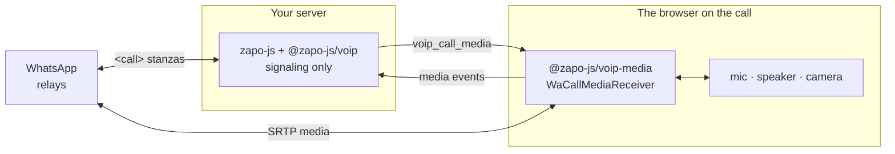

By default a call's media — the relay legs, SRTP, the codec, the jitter buffer and the audio clock — runs in the same process as the [VoIP plugin](/en/guides/voip). That is the right shape for a bot: the audio is synthesized and consumed where the signaling is.

It is the wrong shape when a **person** is on the call. The microphone is in their browser, and routing their audio through your server to be encoded there adds a hop, a codec dependency and a native build to a machine that only needs to speak the protocol.

`media: { mode: 'remote' }` splits the two. Signaling stays on the server; the media runs wherever the audio is, on **`@zapo-js/voip-media`** — a package with no dependency on `zapo-js` and no dependency on Node, which runs in a browser as-is.



<Note>
  **No media flows through your server.** The browser talks to WhatsApp's relays directly; the server only hands it the plan to do so. It therefore needs neither `@roamhq/wrtc` nor `libmlow-wasm-fork`.
</Note>

## Install

On the server, nothing new — just drop the media peers:

```bash
npm install zapo-js @zapo-js/voip
```

In the browser:

```bash
npm install @zapo-js/voip-media libmlow-wasm-fork
```

`@zapo-js/voip-media` is already a dependency of `@zapo-js/voip`, so the server has it transitively; you install it in the browser bundle as a direct dependency. Both of its own peers are **optional**:

| Package | Needed for |
| --- | --- |
| `libmlow-wasm-fork` (`^0.2.0`) | The MLow codec. Required wherever media actually runs. |
| `@roamhq/wrtc` (`>= 0.10.0`) | The relay transport **on Node only**. A browser uses its own `RTCPeerConnection`. |

<Warning>
  The browser needs a **secure context** — HTTPS or `localhost`. Both the microphone (`getUserMedia`) and the `AudioWorklet` are gated on it.
</Warning>

## The split

What stays on the server, and what moves:

| | Server (`@zapo-js/voip`) | Media host (`@zapo-js/voip-media`) |
| --- | --- | --- |
| `<call>` stanzas, offer/accept/terminate | ✅ | |
| Call state, `CallInfo`, `voip_*` events | ✅ | |
| Mute, raise hand, screen share, video upgrade | ✅ | |
| Relay legs, STUN, SRTP | | ✅ |
| MLow encode/decode, jitter buffer | | ✅ |
| H.264 packetize/depacketize | | ✅ |
| Microphone, speaker, camera | | ✅ |
| Emoji reactions (in-band on the media socket) | | ✅ |

Because of that split, these throw or go quiet on the server with remote media:

<Warning>
  With `media: { mode: 'remote' }`, `loadAudio`, `setExternalAudioMode` and `feedLiveAudio` **throw**; `sendReaction` returns `false`; `feedLiveVideo` returns `0`; and `voip_call_inbound_audio` / `voip_call_inbound_video` / `voip_call_inbound_video_rtp` **never fire**. Audio, video and reactions live on the media host.
</Warning>

Everything else about the call — accepting, ending, state events, mute, hands, screen share, upgrades — stays exactly where it was.

## Wiring the server side

Two lines connect the plugin to whatever transport you run between server and browser:

```ts
import { WaClient } from 'zapo-js'
import { voipPlugin } from '@zapo-js/voip'
import { decodeCallMediaEvent, encodeCallMediaMessage } from '@zapo-js/voip-media'

const client = new WaClient({
  store,
  sessionId: 'main',
  plugins: [voipPlugin({ media: { mode: 'remote' } })]
}, logger)

// server → browser: every change to the call's media plan
client.on('voip_call_media', ({ message }) => {
  browserSocket.send(encodeCallMediaMessage(message))
})

// browser → server: what the media host reports back
browserSocket.on('message', (text) => {
  client.voip.media.handleEvent(decodeCallMediaEvent(text))
})
```

<Warning>
  **The plan carries the call's SRTP keys and relay credentials.** `WaCallMediaMessage.plan.keys` and the credentials inside `plan.relays` are secrets: the channel to the media host must be private to that host and encrypted in transit. Never log a plan message, never persist one, and never broadcast it to a room.
</Warning>

### A host that joins late

A browser that connects after the call started — a reload, a second tab taking over — has missed every message so far. `snapshot` hands it the whole plan as it stands:

```ts
const snapshot = client.voip.media.snapshot(callId)
if (snapshot) browserSocket.send(encodeCallMediaMessage(snapshot))
```

It returns `null` for an unknown call, or when media is local. The host also asks for this by itself — see [resync](#ordering-gaps-and-resync).

### `client.voip.media`

| Member | Signature | What it does |
| --- | --- | --- |
| `handleEvent` | `(message: WaCallMediaEventMessage) => void` | Hands over an event the media host sent back, as it arrived. |
| `snapshot` | `(callId: string) => WaCallMediaMessage \| null` | The whole media plan of a call as it stands. `null` for an unknown call or local media. |

## The wire protocol

Two message types travel, both plain JSON with a version field. zapo gives you the codecs; the transport is yours — a WebSocket, an SSE stream plus a POST route, a message queue, anything ordered-ish.

### Server → host: `WaCallMediaMessage`

```ts
interface WaCallMediaMessage {
  readonly v: 1            // WA_CALL_MEDIA_WIRE_VERSION
  readonly callId: string
  readonly seq: number     // per call, from 0
  readonly full: boolean   // true = the whole plan, false = only what changed
  readonly plan: WaCallMediaPlanUpdate
}
```

The plan is the media description the host needs: `keys` (SRTP material), `relays` (endpoints and credentials), `ssrcs`, `settings` and `video`. A `full` message holds all of it; the others hold only the sections that changed.

### Host → server: `WaCallMediaEventMessage`

```ts
interface WaCallMediaEventMessage {
  readonly v: 1
  readonly callId: string
  readonly event: WaCallMediaEvent
}
```

| `event.type` | Payload | Meaning |
| --- | --- | --- |
| `'active'` | — | Media started flowing: the call is accepted and a relay leg is up. |
| `'relay_lost'` | `reason: string` | No relay leg is left. Signaling ends the call ([`EndCallReason.RelayLost`](/en/guides/voip#endcallreason)). |
| `'reaction'` | `reaction: WaCallReaction` | An in-band emoji reaction arrived from the peer. |
| `'resync'` | `lastSeq: number \| null` | The host missed a message and needs the whole plan again. |

### Encoding

```ts
import {
  encodeCallMediaMessage, decodeCallMediaMessage,
  encodeCallMediaEvent,   decodeCallMediaEvent
} from '@zapo-js/voip-media'
```

Each `encode*` returns a `string` and each `decode*` takes one. JSON has no binary type and no `bigint`, so the encoding tags both: byte arrays travel under `$bytes` (base64) and a reaction's `uint64` transaction id under `$bigint`. **Always go through these functions** — a hand-rolled `JSON.stringify` loses the SRTP keys and the transaction id.

`WA_CALL_MEDIA_WIRE_VERSION` is `1`. Only a breaking change moves it; a new field is optional.

### Ordering, gaps and resync {#ordering-gaps-and-resync}

`WaCallMediaReceiver` applies messages one at a time, in call order, and keeps the last `seq` it accepted:

- A message **older** than the last accepted one is dropped.
- A gap (`seq > lastSeq + 1`) emits a `resync` event carrying `lastSeq`. Answer it with `snapshot(callId)`.
- A `full` message is accepted whenever its `seq` is not behind, which is what makes the snapshot answer work.
- A message whose apply **rejects** is not counted as received, so the next one finds the gap and asks for a resync by itself.

You do not have to implement any of this — it is the receiver's job. You only have to answer `resync` with a snapshot.

## The browser

### Audio

The minimum viable call. Build the receiver, start listening, then open the audio from a user gesture:

```ts
import {
  decodeCallMediaMessage,
  encodeCallMediaEvent,
  WaCallMediaReceiver
} from '@zapo-js/voip-media'
import { WaWebCallAudio, webMediaHost } from '@zapo-js/voip-media/web'

const receiver = new WaCallMediaReceiver({
  ...webMediaHost,
  callId,
  send: (event) => socket.send(encodeCallMediaEvent(event))
})

// Listen BEFORE any await: a plan that arrives meanwhile would be lost.
socket.onmessage = (event) => receiver.receive(decodeCallMediaMessage(event.data))

await receiver.start()   // loads the codec

let audio: WaWebCallAudio | undefined

answerButton.onclick = async () => {
  // Opens mic and speaker. Must run inside the gesture.
  audio = await WaWebCallAudio.start(receiver.plane)
  // The accept itself stays on the server:
  await fetch(`/calls/${callId}/accept`, { method: 'POST' })
}

// when voip_call_ended reaches the browser:
await audio?.stop()
receiver.stop()
```

<Warning>
  Attach the socket listener **before** the first `await`. `receiver.start()` loads the WASM codec, and a plan message that lands during that await with no listener attached is simply gone — the receiver will later see a gap and resync, but you have paid a round-trip for nothing.
</Warning>

<Tip>
  Call `WaWebCallAudio.start` from inside the click handler, not after an `await` that escapes the gesture. The `AudioContext` is created and resumed before the first `await` internally, but the gesture has to still be live when you call it, or `getUserMedia` and the context can stall.
</Tip>

The accept stays on the server on purpose: it is a `<call>` stanza, and only the server speaks the protocol. The click that answers asks the server for it and opens the audio locally; the two happen together.

#### `WaWebCallAudio`

`WaWebCallAudio.start(sink, options?)` carries audio between the browser's microphone and speaker and a sink — `receiver.plane` satisfies that sink. The **audio device's clock paces both directions**, so a throttled background tab does not starve the call.

<ParamField path="microphone" type="MediaStream">
  Microphone to capture. Default: `getUserMedia` with echo cancellation, noise suppression and auto gain — the codec does none of those, they come from the browser. A stream you pass in is **not** stopped by `stop()`.
</ParamField>

<ParamField path="audioContext" type="AudioContext">
  Context to run in. Default: a new 16 kHz `AudioContext`, falling back to the device rate if the browser refuses. A context you pass in is neither closed nor resumed by `stop()`.
</ParamField>

<ParamField path="workletUrl" type="string">
  URL of the worklet module. Default: a Blob URL. Under a CSP that forbids `blob:`, serve the exported `WA_CALL_AUDIO_WORKLET_SOURCE` as a file and pass its URL here.
</ParamField>

`stop()` releases only what the adapter acquired, and a repeat call returns the same promise.

<Note>
  Firefox refuses a microphone at a foreign sample rate. The adapter handles it: if it owns the context and the 16 kHz rate is refused, it reopens at the device rate and retries.
</Note>

### Video

Build the receiver with `onInboundVideo` for the peer's frames, and hand the plane a camera track for yours:

```ts
import { WaWebCallVideoReceiver, WaWebCallVideoSender } from '@zapo-js/voip-media/web'

const video = new WaWebCallVideoReceiver({
  onFrame: (frame, ssrc) => {
    context2d.drawImage(frame, 0, 0)
    frame.close()          // the frame is yours to close
  }
})

const receiver = new WaCallMediaReceiver({
  ...webMediaHost,
  callId,
  send: (event) => socket.send(encodeCallMediaEvent(event)),
  onInboundVideo: (frame) => video.push(frame)
})

const [camera] = (await navigator.mediaDevices.getUserMedia({ video: true })).getVideoTracks()
const sender = await WaWebCallVideoSender.start(receiver.plane, camera)

// when the call ends, alongside the audio:
await sender.stop()
camera.stop()
video.close()
```

Both sides use **WebCodecs**. `WaWebCallVideoSender.start` throws when the browser has no `VideoEncoder`, or when you hand it a track that is not video.

<Warning>
  `onFrame` hands you a `VideoFrame` that **you** must `close()`. A frame you forget pins GPU memory, and a few seconds of that stalls the decoder.
</Warning>

#### `WaWebCallVideoSender` options

| Option | Default | Notes |
| --- | --- | --- |
| `frameRate` | `15` | Most frames per second encoded; a faster source is thinned (with a 20% allowance, so a source at exactly the rate is not halved). |
| `bitrate` | `600_000` | Encoder target, bits per second. |
| `keyFrameIntervalMs` | `2000` | Longest run between key frames. Key-frame **requests are not acted on**, so this alone bounds how long a receiver waits after a loss. |
| `codec` | `'avc1.42E01F'` | WebCodecs codec string — Constrained Baseline 3.1. |
| `hardwareAcceleration` | browser's choice | As WebCodecs takes it. |
| `onError` | — | An encoder failure. The next frame builds a new encoder, starting on a key frame. |

`sender.stats` reports `framesCaptured`, `framesEncoded`, `framesSent`, `framesDropped`, `packetsSent`, `keyFrames`, `width`, `height`.

#### `WaWebCallVideoReceiver` options

| Option | Default | Notes |
| --- | --- | --- |
| `onFrame` | **required** | `(frame: VideoFrame, ssrc: number) => void`. Yours to close. |
| `hardwareAcceleration` | browser's choice | A hardware decoder may buffer several frames before its first output; `'prefer-software'` avoids that latency. |
| `onError` | — | A decoder failure. The stream resumes on its next key frame. |

`receiver.stats` reports `framesReceived`, `framesDecoded`, `framesDropped` (before the first key frame, or after a failure), `decodeErrors`, and `codec` — read off the sequence parameter set of the stream decoded last.

### `webMediaHost`

Spreading `...webMediaHost` into the receiver options supplies the two platform primitives the media plane needs in a browser:

- `crypto` — `webCrypto`, built on the browser's own `crypto.subtle`.
- `createPeerConnection` — `createBrowserPeerConnection`, the browser's own `RTCPeerConnection`. A configuration the browser refuses rejects the promise.

There are no raw UDP legs in a browser, so `useRawUdpTransport` has no meaning there.

## `WaCallMediaReceiver`

```ts
const receiver = new WaCallMediaReceiver(options)
```

| Member | Signature | Notes |
| --- | --- | --- |
| `plane` | `WaCallMediaPlane` | The media plane itself — what `WaWebCallAudio` and `WaWebCallVideoSender` attach to. |
| `start()` | `Promise<void>` | Loads the codec. |
| `receive(message)` | `Promise<void>` | Applies one message, one at a time in call order. |
| `stop()` | `WaCallMediaStats` | Tears the plane down and returns the call's media statistics. |

Options extend the plane's own, plus:

<ParamField path="callId" type="string" required>
  The call this receiver serves. A message for a different call id rejects.
</ParamField>

<ParamField path="send" type="(message: WaCallMediaEventMessage) => void" required>
  Hands an event back to signaling, over whatever transport you run.
</ParamField>

<ParamField path="onReaction" type="(reaction: WaCallReaction) => void">
  Also told of the reactions that go to signaling, for a host that renders them itself.
</ParamField>

<ParamField path="onInboundVideo" type="(frame: InboundVideoFrame) => void">
  One reassembled H.264 access unit of a peer video stream, keyed by `frame.ssrc`.
</ParamField>

<ParamField path="onInboundVideoRtp" type="(packet: InboundVideoRtpPacket) => void">
  Each decrypted inbound video RTP packet, before reassembly.
</ParamField>

<ParamField path="logger" type="Logger">
  Optional. `createNoopLogger()` is exported for when you want the shape without the output.
</ParamField>

<Note>
  `onActive` and `onRelayLost` are **not** yours to set — the receiver owns them and turns them into the `active` and `relay_lost` events it sends back to signaling.
</Note>

### Call statistics

`stop()` returns `WaCallMediaStats`, which is the thing to log when a call sounded wrong:

| Group | Fields |
| --- | --- |
| Relay | `relayPackets` |
| Outbound audio | `audioSent`, `audioDropped`, `audioTimelineResyncs`, `audioFramesShed`, `audioCaptureSkewMs` |
| Inbound audio | `audioReceived`, `decoded`, `decodeErrors`, `playout` (jitter-buffer stats) |
| SRTP | `srtpErrors` (the sum), `srtpReplays`, `srtpAuthFailures`, `srtpOtherErrors` |
| Video | `videoFramesSent`, `videoPacketsReceived`, `videoFecDiscarded` |

<Tip>
  `audioCaptureSkewMs` is the capture instant minus the timestamp of the last audio frame sent: positive means the timeline is running behind. A steady climb there is a host that cannot keep up with the clock, not a network problem.
</Tip>

## Media on a second Node process

The browser is the common case, but nothing about the split is browser-specific. A second Node process is the same wiring with the Node host and the Node peers installed there:

```ts
import { WaCallMediaReceiver } from '@zapo-js/voip-media'
import { nodeMediaHost } from '@zapo-js/voip-media/node'
```

`nodeMediaHost` supplies `nodeCrypto` (`node:crypto`) and `createWrtcPeerConnection` (`@roamhq/wrtc`). That host needs `@roamhq/wrtc` and `libmlow-wasm-fork`, exactly as a local-media server would — the dependencies follow the media, not the signaling.

Raw UDP legs stay off there too; a host that wants them passes the leg factory explicitly:

```ts
import { nodeMediaHost, WaRawUdpLeg } from '@zapo-js/voip-media/node'

const receiver = new WaCallMediaReceiver({
  ...nodeMediaHost,
  createRawUdpLeg: (options) => new WaRawUdpLeg(options),
  callId,
  send: (event) => socket.send(encodeCallMediaEvent(event))
})
```

Read the warning on [`useRawUdpTransport`](/en/guides/voip#plugin-options) before you do — it is an experiment, not a tuning knob.

## See also

<CardGroup cols={2}>
  <Card title="Calls (VoIP)" icon="phone" href="/en/guides/voip" arrow>
    The signaling side: placing and answering calls, mute, hands, screen share, video upgrades.
  </Card>
  <Card title="Plugin system" icon="puzzle-piece" href="/en/concepts/plugins" arrow>
    How `voipPlugin()` plugs into `WaClient`.
  </Card>
</CardGroup>
