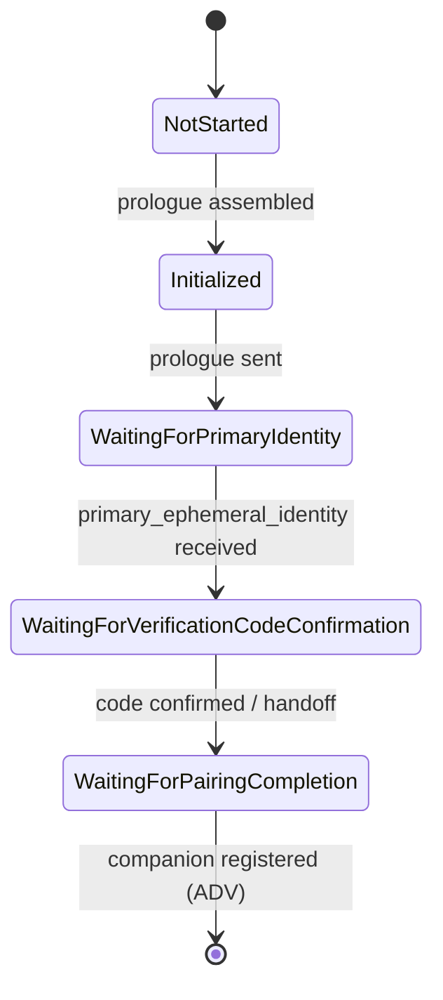
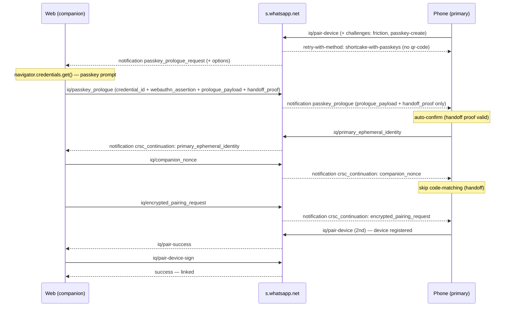

WhatsApp is rolling out **passkey-gated device linking**: for some accounts the server refuses the normal QR / pairing-code flow and demands a **WebAuthn passkey assertion** before a companion can link. The official clients call this flow **Shortcake** (web side) and **CRSC** — *Companion Registration over Side Channel* (phone side).

This page documents that flow as reverse-engineered from the WhatsApp Web bundle and the decompiled Android app, then cross-checked against a live, packet-correlated capture of a real linking. It is here for the curious and for contributors who need to understand why a passkey-gated account behaves differently.

<Note>
  `zapo` is an **independent, from-scratch** implementation of the WhatsApp protocol and is **not affiliated with, endorsed by, or connected to WhatsApp or Meta**. Everything here is interoperability research derived from observing publicly shipped clients on the wire. All real identifiers, keys, signatures, and account data from the original capture have been **redacted** and replaced with placeholders.
</Note>

<Warning>
  **There is no headless bypass.** The recurring conclusion — established empirically, not just inferred — is that on a passkey-gated account, linking a companion requires an assertion from the **account owner's own authenticator**. This page explains *why* the wall holds, so you understand the boundary rather than waste time looking for a hole that isn't there.
</Warning>

## Overview of the passkey flows

Passkeys touch several distinct surfaces. The one that matters for a companion library is **linking**; the rest are listed for completeness.

| Flow | Side | What the passkey does |
| --- | --- | --- |
| **Shortcake linking** | Web (companion) | Link a companion using a passkey assertion instead of a QR scan. |
| **Integrity checkpoint** | Web (companion) | Anti-abuse session challenge: passkey assertion **or** captcha. |
| Login / registration | Mobile (primary) | Passkey in place of the SMS code. |
| Encrypted backup | Mobile (primary) | Gate + PRF secret for end-to-end encrypted backups. |
| In-thread / settings / creation | Mobile (primary) | Management and native-auth surfaces. |

The asymmetry is the key mental model:

- The **phone (primary)** *owns* the passkey — it creates, manages, and uses it (login, backup, linking), through the Android **Credential Manager** with the WebAuthn **PRF** extension.
- The **web (companion)** only *uses* a passkey — for linking and for the integrity checkpoint.

Creating a passkey on the web is the generic Meta CAA/Bloks flow, **not** a WhatsApp-web-specific path, and is out of scope here.

## Shortcake: linking with a passkey

### The trigger

The passkey prologue is **server-driven**. It is not a button, and not a client-side A/B flag — the companion cannot initiate it. The server pushes a notification to the **web** side:

```xml
<notification from="s.whatsapp.net" type="passkey_prologue_request"
    id="«stanza-id»" t="«unix-ts»" offline="0">
  <passkey_request_options>«1..4096 bytes: JSON UTF-8 PublicKeyCredentialRequestOptions»</passkey_request_options>
</notification>
```

- `type="passkey_prologue_request"` is the literal discriminator; `from` defaults to the `s.whatsapp.net` domain JID; `t` and `id` are required.
- `<passkey_request_options>` is optional inline content (1–4096 bytes) — the WebAuthn request options as JSON, with `challenge` and each `allowCredentials[].id` in base64url. If absent, the companion fetches them with an IQ.
- The web replies with a transport **ack**, then runs the prologue.

Empirically the server issues this **as a continuation of an otherwise-normal pairing**: on a gated account it answers the primary's `pair-device` with a `retry-with-method` listing `shortcake-with-passkeys` (and, when it wants no fallback, **omits** `qr-code`). The passkey does not *replace* the QR step in the UI — it is bolted on after it.

<Note>
  The prologue rides **either linking carrier**. It can follow the QR `pair-device`, or arrive right after a **pairing-code** link — the `companion_hello` → `primary_hello` → `companion_finish` handshake (handled on the web through the `link_code_companion_reg` notification). In captured logs the server sent `passkey_prologue_request` roughly 3 seconds after `companion_finish`.
</Note>

### The prologue request stanza

The inline `passkey_request_options` decode to a standard WebAuthn `get()` request:

```json
{
  "challenge": "«base64url challenge»",
  "timeout": 600000,
  "rpId": "whatsapp.com",
  "allowCredentials": [],
  "userVerification": "required",
  "extensions": { "uvm": true }
}
```

`allowCredentials: []` means a **discoverable** credential — the account already has a passkey, so no credential id needs to be named. `rpId` is `whatsapp.com`.

### The companion prologue

On receiving the request, the web side runs a fixed sequence:

<Steps>
  <Step title="Get request options">
    From the inline content, or via an IQ if the server did not embed them.
  </Step>
  <Step title="Perform the WebAuthn assertion">
    Decode `challenge` / `allowCredentials[].id` from base64url and call `navigator.credentials.get({ publicKey })`. **This is the passkey prompt** — user verification happens on the owner's device. Re-encode `clientDataJSON` / `authenticatorData` / `signature` / `userHandle` back to base64url.
  </Step>
  <Step title="Fetch a linking ref">
    An IQ `GetRef` returns the `ref` string that scopes this linking session.
  </Step>
  <Step title="Initialize the Shortcake session">
    Generate the ephemeral keypair, nonce, and commitment, and assemble the `prologue_payload` (see [cryptography](#the-cryptography)).
  </Step>
  <Step title="Optionally compute a handoff proof">
    If a pairing handoff key is available (derived from the ADV secret), compute the proof — it lets the *phone* skip its confirmation UX.
  </Step>
  <Step title="Send the prologue">
    An IQ carries `credential_id`, `webauthn_assertion`, `prologue_payload`, and (optionally) `pairing_handoff_proof`. The web then waits for the primary's identity.
  </Step>
</Steps>

### The linking state machine

The companion advances through a small state machine, guarded by a 120-second timeout:



- On `primary_ephemeral_identity` the companion reveals its nonce (via a `companion_nonce` IQ), derives the verification code, and — unless a valid handoff proof let both sides skip it — shows the code for matching.
- Confirmation encrypts the pairing request (AES-GCM) and sends it as `encrypted_pairing_request`.

### The cryptography

The whole handshake is a commit-reveal ECDH carried entirely in stanzas (because, unlike QR, there is no out-of-band channel carrying the keys):

| Step | Construction |
| --- | --- |
| **Keypair + nonce** | Ephemeral **X25519** keypair; `companion_nonce` = 32 random bytes. |
| **Commitment** | `prologue_payload` carries the companion identity plus `hash = SHA-256(companionEphemeralIdentity ‖ companionNonce)` — commit now, reveal the nonce later. |
| **Verification code** | `a = SHA-256(companionNonce ‖ primaryPubKey)`; `code[0..5] = primaryNonce[0..5] ⊕ a[0..5]`; encoded as **Crockford base32** (5 bytes). |
| **Session key** | `shared = X25519(companionPriv, primaryPub)`; `HKDF(shared, salt = "Companion Pairing <deviceType> with ref <ref>", info = "Pairing Information Encryption Key", 32)`. |
| **Encrypt** | AES-GCM with a random 12-byte IV over the pairing-request plaintext. |

The commitment binds the companion's nonce before the primary answers, so the primary cannot grind a chosen verification code.

### The primary (phone) side

On the phone, CRSC is the mirror image. It receives the prologue (relayed by the server), generates its own `PrimaryEphemeralIdentity`, and derives the same code. Two behaviours are worth calling out because they are frequently misread:

- **Auto-confirm via handoff proof.** If the companion included a valid `pairing_handoff_proof` — an HMAC over the prologue keyed by a handoff key derived from the ADV secret, gated on a phone-side A/B flag, the app being in the foreground, and an unexpired stashed key — the phone **skips its own confirm-device and code-matching screens**.
- **The handoff proof is a *primary-side* shortcut, not a companion bypass.** It removes friction for the phone's owner. It does **not** remove the companion's obligation to produce a real `webauthn_assertion`. In the same linking, the web still runs `navigator.credentials.get` and sends the assertion; the two artifacts serve different purposes.

<Note>
  The server validates the `webauthn_assertion` and does **not** relay it to the phone. The primary receives only `prologue_payload` + `pairing_handoff_proof` — never the assertion. It trusts the handoff proof; the server is the party that checked the passkey.
</Note>

## Passkey vs QR: the stanza sequence

Both flows converge on the **same ADV registration** of the companion, but the choreography differs sharply.

**Passkey (from the web/companion's point of view — ◄ received / ► sent):**

| # | Dir | Stanza |
| --- | --- | --- |
| 1 | ◄ | notification `passkey_prologue_request` (+ inline options, optional) |
| 2 | ► | ack |
| 3 | ► | IQ `GetPasskeyRequestOptions` (only if not inlined) |
| 4 | ► | IQ `GetRef` |
| 5 | ► | IQ `SetPasskeyPrologue` (`credential_id` + `webauthn_assertion` + `prologue_payload` + handoff proof) |
| 6 | ◄ | notification `primary_ephemeral_identity` |
| 7 | ► | IQ `SetCompanionNonce` (reveal) |
| 8 | ► | IQ `SetEncryptedPairingRequest` |
| 9 | ◄ | completion — companion registered via ADV |

**QR (for contrast):**

| # | Dir | Stanza |
| --- | --- | --- |
| 1 | ◄ | IQ set `pair-device` (`<ref>` list for the QR) |
| 2 | ► | IQ result (ack) |
| 3 | — | phone scans the QR (out of band) |
| 4 | ◄ | IQ set `pair-success` (ADV signed device identity + device + platform) |
| 5 | ► | IQ result `pair-device-sign` |
| 6 | — | `stream:error 515` → reconnect with credentials → linked |

**The difference:** QR is two IQs each way, the companion only *responds*, and the key exchange rides the QR out of band. Passkey has the companion **initiate** the IQs and carries the entire ECDH handshake **in stanzas** — because there is no QR to carry the keys.

## Correlated wire capture

To move from "reconstructed from bundles" to "confirmed", the flow was captured on **both ends of one real linking at the same time** — live instrumentation on the phone (primary) and a console capture on WhatsApp Web (companion) — then correlated byte-for-byte. All values below are redacted.

### Unified timeline



### The CRSC relay

The server `s.whatsapp.net` is a **relay**. Each side sends an `<iq to="s.whatsapp.net">`; the other receives it as a `<notification from="s.whatsapp.net">` (`crsc_continuation` / `passkey_prologue`). The proof that it is genuinely one session: the five CRSC payloads are **byte-identical** on both ends (the ephemeral X25519 key is random per session, so this is not coincidence).

| Payload | Web | Phone | Identical |
| --- | --- | --- | --- |
| `prologue_payload` | sent (iq passkey_prologue) | recv (notif passkey_prologue) | ✓ |
| `pairing_handoff_proof` | sent | recv | ✓ |
| `primary_ephemeral_identity` | recv (notif crsc) | sent (iq) | ✓ |
| `companion_nonce` | sent (iq) | recv (notif crsc) | ✓ |
| `encrypted_pairing_request` | sent (iq) | recv (notif crsc) | ✓ |

Routing works because the primary's `primary_ephemeral_identity` IQ carries `companion_ref` equal to the `ref` inside the `prologue_payload`, so the server can deliver it to the correct web session.

<Note>
  The `passkey_prologue` the **phone** receives contains only `prologue_payload` + `pairing_handoff_proof` — **not** the `webauthn_assertion`. The server validates the assertion and does not forward it. The assertion never reaches the phone.
</Note>

### Decoded payloads

The WebAuthn assertion is a genuine ceremony — the `challenge` inside `clientDataJSON` equals the challenge from the request options:

```
// clientDataJSON (web → server, inside passkey_prologue)
{ "type": "webauthn.get", "challenge": "«same challenge as options»",
  "origin": "https://web.whatsapp.com", "crossOrigin": false }

// authenticatorData = SHA-256("whatsapp.com") ‖ flags(UP|UV) ‖ counter(0)
// signature         = ECDSA P-256 (DER)
// userHandle, credential_id  = «redacted»
```

The CRSC protobufs (field numbers shown; values redacted):

```
ProloguePayload:
  1 CompanionEphemeralIdentity { 1 publicKey=«X25519 32B»  2 deviceType=1  3 ref="«companion ref»" }
  2 CompanionCommitment        { 1 hash=«SHA-256 32B» }

PrimaryEphemeralIdentity:
  1 publicKey = «X25519 32B»
  2 nonce     = «32B»
```

`companion_nonce` is the 32-byte reveal of the commitment. `encrypted_pairing_request` is AES-GCM over the pairing request (companion public key, identity key, ADV secret) under the ECDH-derived key — not decodable without that key.

### Node-level detail

For completeness, the two ADV registration stanzas that bookend the CRSC exchange — the mobile `pair-device` (the registration attempt that draws the `retry-with-method`) and the `pair-success` the companion receives once CRSC completes — with their child nodes (values redacted):

```xml
<!-- mobile primary → server: pair-device (registration attempt) -->
<iq type="set">
  <pair-device>
    <ref>«ref»</ref>
    <pub-key>«32B»</pub-key>
    <device-identity>«158B ADV»</device-identity>
    <key-index-list>…</key-index-list>
    <pem>«RSA-2048»</pem>
    <encryption-metadata>«RSA-2048: encrypted_key 256B / nonce / encrypted_data / auth_tag»</encryption-metadata>
    <challenges><supported><friction variant="1"/><passkey-create/></supported></challenges>
  </pair-device>
</iq>

<!-- server → companion: pair-success (after CRSC completes) -->
<iq type="set">
  <pair-success>
    <device-identity>«158B, ADV-signed»</device-identity>
    <biz name="«redacted»"/>
    <platform name="smba"/>
    <device jid="«device jid»" lid="«device lid»"/>
    <encryption-metadata version="1" algorithm="aes-256-gcm">…</encryption-metadata>
    <jurisdiction iso="BR" cc="55"/>
  </pair-success>
</iq>

<!-- companion → server: counter-sign; then the stream closes and reopens logged-in -->
<iq type="result">
  <pair-device-sign>
    <device-identity key-index="3">«152B»</device-identity>
  </pair-device-sign>
</iq>
<!-- → success (companion_enc_static, abprops, lid) → linked -->
```

The `<challenges><supported>` axis (`friction` / `passkey-create`) is **orthogonal** to `retry-with-method`: the former declares which *creation* challenges the primary supports, the latter is the server's chosen *linking method*. Advertising or omitting `passkey-create` does not change the method decision.

## The integrity checkpoint

A **second**, unrelated passkey surface on the web is the anti-abuse **integrity checkpoint** — the sibling of the captcha challenge. It is **not** random: it is a server-side, risk-based decision.

- The server pushes a **MEX** (GraphQL-over-WA) notification whose `challenge_type` is `PASSKEY` or `CAPTCHA`. A `PASSKEY` challenge carries a `challenge_base64`; a `CAPTCHA` one carries a `site_key` + `challenge_url`. The chosen challenge is persisted so it survives a page reload.
- For `PASSKEY`, the web opens a **non-dismissible** modal offering: complete the challenge, or log out.
- Completing it runs `credentials.get({ rpId: "whatsapp.com", userVerification: "preferred", extensions: { prf: { eval: { first: "whatsapp-challenge" } } } })` and submits the assertion (plus its PRF output) via a MEX mutation.

On the wire, MEX is GraphQL-over-IQ. The response goes out as a generic MEX envelope:

```xml
<!-- companion → server: submit the challenge response (mexSubmitPasskeyChallengeResponse) -->
<iq type="get" xmlns="w:mex" id="«id»">
  <query query_id="«numeric operation id»">«JSON variables: the passkey assertion + prf_output»</query>
</iq>
```

Only the decoded fields above and the response operation name were reverse-engineered. The exact operation ids, the full variable schema, and the **server → client challenge push** envelope were **not captured** — so, unlike the CRSC/ADV stanzas, the integrity-challenge MEX has no fully reversed wire form here (see [Open questions](#open-questions)).

<Warning>
  The integrity checkpoint asserts an **existing** passkey (or a captcha). It does **not** create a passkey and does **not** route into the QR or Shortcake flow. The outcome is binary: pass and keep the session, or log out.
</Warning>

## Passkey-create friction

A third surface — easily confused with linking — is the **passkey-create bottom sheet** that appears *during a normal QR / pairing-code link*. It is an **anti-abuse gate in the middle of QR pairing**, not a link-by-passkey flow.

- **"Don't link"** cancels the pairing outright (it does *not* fall back to QR).
- **"Create"** runs the passkey-creation flow, reports `created=true` to the server, and **resumes the same QR pairing**. On error it reports `created=false` and *also* resumes — the server decides.

The takeaway: **creating a passkey ≠ linking by passkey.** Creation is a gate that reports a signal to the server, after which the ordinary QR registration continues.

## Who decides: passkey or QR

- **The user does not choose the method** — not on the web, not in the phone's linked-devices screen. On the phone the user only *approves* (biometric + code confirm) or *cancels*.
- **The server decides**, based on an A/B allocation (a per-account flag, id `29205` in the server-pushed config overlay), whether the account has a passkey, and a risk/integrity signal (the captcha family).
- **Hard client-side gates** still apply: WebAuthn must be available, PRF must be supported, and (for the handoff shortcut) the phone must be in the foreground.
- **The exact server risk criterion is not in the client bundles** — it is server-side by design.

### Why the passkey is central: PRF

WhatsApp passkeys use the WebAuthn **PRF** extension to derive a **stable secret** from the credential (`extensions.prf` with an eval input like `"whatsapp-challenge"`). That PRF-derived secret backs login, encrypted backup, and related surfaces — which is why the passkey is load-bearing rather than a mere second factor.

## Can the passkey be bypassed

Every client-side lever was tested on live accounts. All of them fail; the wall is enforced **server-side, per account**.

### The client-side levers

| Lever | Account | Result |
| --- | --- | --- |
| Companion skips the `webauthn_assertion` | — | Mandatory; the assertion never reaches the primary, so there is nothing to fake. |
| Primary turns the `29205` gate **off** | gated | Error 500, **no** normal fallback. |
| Primary **removes** the `passkey-create` capability | gated | Server forces Shortcake anyway. |
| Primary forces the `29205` gate **on** | not gated | The gate is never even read; links normally. |
| Primary **injects** the `passkey-create` capability | not gated | Server ignores it; links normally. |

The capability the phone advertises and the phone-side flag are both **reactive** — they only decide whether the phone *obeys* a server `retry-with-method` that has already been sent. Neither is a trigger. The decision is **100% the account's server-side bucket**.

### The server verifies the assertion

The last uncertainty — does the server actually verify the assertion signature, or accept any well-formed structure plus a valid handoff proof? — was tested by relaying a **forged** assertion: the *real* discoverable credential id, but signed with a **different** P-256 key over the fresh server challenge, alongside a legitimate handoff proof.

The result: the server ack'd the transport IQ and then **went silent** — it did not relay the prologue to the phone, no `primary_ephemeral_identity` came back, and both ends stalled until timeout. The server found the credential, checked the signature against the **registered** public key, failed, and **rejected silently** (no error IQ — a likely anti-enumeration design). A valid handoff proof did **not** substitute for a valid assertion.

<Check>
  Confirmed empirically: the server verifies the WebAuthn assertion against the account's registered public key, with a fresh challenge (no replay). A forged assertion is rejected. The passkey wall is real and enforced end-to-end.
</Check>

### Platform and version gates

On a gated account the server also gates on the **companion's platform** and **build**:

- **Platform.** Any *web* companion (Chrome, Firefox, Safari, Electron desktop, UWP — all `platform_type = 2`) is routed into the passkey. An *android* companion (`platform_type = 10`) is rejected up front with `<error code="463" text="account_reachout_restricted"/>` — the Shortcake ceremony is web-only, so the server refuses rather than route to a flow the phone could never complete. Switching to android does not dodge the passkey; it just trades one wall for another.
- **Version.** No client version avoids it. Too old is rejected at the Noise handshake (`<failure reason='405'/>`, *client_too_old*); a fake-but-recent build fails at `pair-device` with `<error code="400" text="bad-request"/>` (the server validates the build hash against real builds); only the genuine current build passes both — into the passkey.

## Practical takeaway

For any headless or companion client, the boundary is concrete:

- A **passkey-gated** account (server bucket `29205=true`) offers Shortcake as the **only** completion path — no QR fallback. Linking such an account requires a **real assertion from the owner's own authenticator**, obtained on the owner's device/browser and relayed into the flow. That is *using* the real passkey, not bypassing it.
- A **non-gated** account links normally with QR / pairing code; the passkey machinery is never engaged.

The reason a headless client cannot manufacture the assertion is by design: WebAuthn requires proximity (hybrid/caBLE needs BLE), synced passkeys need the credential present on the machine calling `get()`, and the private key is non-exportable. None of these yield to a remote, credential-less caller.

## Open questions

The parts that remain unknown are, by design, **server-side**:

- The exact risk criterion that puts an account in the passkey bucket (beyond "has a passkey" + the A/B allocation).
- What, beyond that, makes the server emit `passkey_prologue_request`.
- The full schema of the MEX integrity-challenge mutation and its receiving side.

For the protocol layers this flow sits on top of — Noise, stanzas, Signal, ADV — see [The WhatsApp protocol](/en/concepts/protocol) and [Architecture in depth](/en/concepts/internals).
