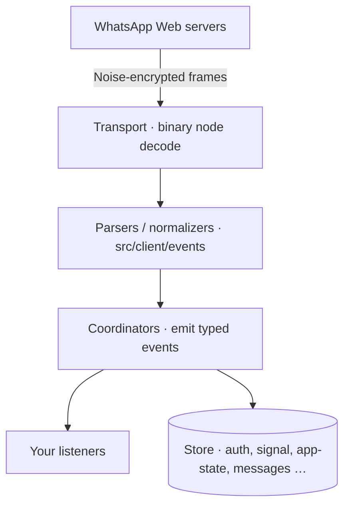

O `zapo` é organizado em torno de um **client** enxuto que delega cada funcionalidade a um **coordinator** focado. O client é dono da conexão, da autenticação e do emissor de eventos; os coordinators são donos da lógica de domínio.

## O client {#the-client}

O [`WaClient`](/pt-br/reference/client) é o único ponto de entrada. Você o constrói com opções e um logger opcional, e então chama `connect()`:

```ts
const client = new WaClient({ store, sessionId: 'default' }, logger)
await client.connect()
```

O client em si expõe apenas uma superfície pequena: ciclo de vida da conexão (`connect`, `disconnect`, `logout`), consultas de estado (`getState`, `getCredentials`) e o emissor de eventos tipado (`on`, `once`, `off`). Todo o resto fica atrás de um getter de coordinator.

## Coordinators {#coordinators}

Cada coordinator é acessado por um getter no client. Eles são conectados de forma lazy na construção e é seguro manter referências a eles.

| Getter | Coordinator | Responsabilidade |
| --- | --- | --- |
| `client.auth` | `WaAuthClient` | Pareamento, credenciais, estado de registro |
| `client.message` | `WaMessageCoordinator` | Envio/recebimento, recibos, download de mídia, addons |
| `client.presence` | `WaPresenceCoordinator` | Presença própria/de terceiros e chat-state |
| `client.chat` | `WaAppStateMutationCoordinator` | Configurações de chat: silenciar, fixar, arquivar, ler, excluir |
| `client.group` | `WaGroupCoordinator` | Grupos e comunidades |
| `client.newsletter` | `WaNewsletterCoordinator` | Canais: criar, enviar, seguir, administrar |
| `client.status` | `WaStatusCoordinator` | Envio de status (broadcast) e reações |
| `client.broadcastList` | `WaBroadcastListCoordinator` | Gerenciamento de listas de transmissão e envios |
| `client.privacy` | `WaPrivacyCoordinator` | Categorias de privacidade, lista de bloqueios |
| `client.profile` | `WaProfileCoordinator` | Foto de perfil, texto de status, nome de usuário |
| `client.business` | `WaBusinessCoordinator` | Perfil business, nomes verificados |
| `client.bot` | `WaBotCoordinator` | Perfis e prompts de bot (Meta AI e outros) |
| `client.email` | `WaEmailCoordinator` | Vincular/verificar e-mail na conta |
| `client.lowlevel` | `WaLowLevelCoordinator` | Escape hatch para envio/query de node bruto |

Como os tipos dos coordinators são exportados a partir da raiz do pacote, você pode anotá-los em TypeScript:

```ts
import type { WaGroupCoordinator } from 'zapo-js'

const groups: WaGroupCoordinator = client.group
```

## Fluxo de dados {#data-flow}



- **Entrada**: os frames são decodificados em binary nodes, parseados e normalizados em payloads de eventos tipados, e então emitidos (`message`, `receipt`, `group`, …).
- **Saída**: sua chamada a um coordinator (por exemplo, `client.message.send`) é construída em um node de protocolo, criptografada e escrita no socket; o coordinator resolve assim que o servidor envia o ack.

## Convenções de engenharia {#engineering-conventions}

Se você ler o código-fonte, estas convenções são onipresentes e explicam boa parte do formato da API:

- **`Uint8Array` em todo lugar** para dados binários (`Buffer` é evitado), com views zero-copy nos caminhos quentes.
- **Apenas named exports** — não há default exports.
- **Sem enums** — as constantes usam `Object.freeze({ ... } as const)`, expostas como os objetos `WA_*`.
- **Estruturas em memória limitadas** para evitar crescimento ilimitado em processos de longa duração.

## A seguir {#next}

<CardGroup cols={2}>
  <Card title="Autenticação" icon="qrcode" href="/pt-br/concepts/authentication">
    Pareamento com QR ou um código de 8 dígitos, e o ciclo de vida das credenciais.
  </Card>
  <Card title="Eventos" icon="bell" href="/pt-br/concepts/events">
    O mapa completo de eventos e como escutá-los.
  </Card>
  <Card title="Stores" icon="database" href="/pt-br/concepts/stores">
    Providers, domínios e backends.
  </Card>
  <Card title="Configuração" icon="sliders" href="/pt-br/concepts/configuration">
    Cada campo de `WaClientOptions` explicado.
  </Card>
</CardGroup>
