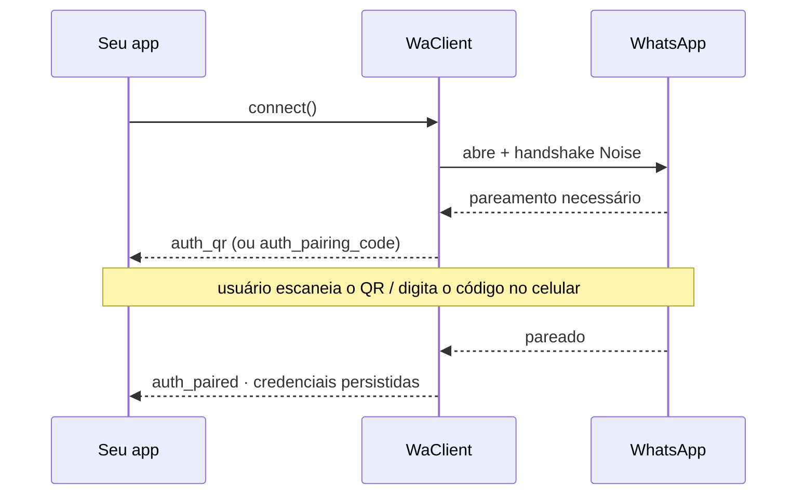

O `zapo` conecta-se como um **dispositivo complementar (companion device)** — exatamente como vincular o WhatsApp Web ou o Desktop. A primeira conexão pareia o dispositivo; depois disso, as credenciais armazenadas na sua [store](/pt-br/concepts/stores) são reutilizadas automaticamente.

## O fluxo de pareamento {#the-pairing-flow}

O pareamento é conduzido inteiramente por eventos emitidos durante o `connect()`:



| Evento | Payload | Quando |
| --- | --- | --- |
| `auth_qr` | `{ qr: string, ttlMs: number }` | Um novo QR está disponível para renderizar. Reemitido conforme ele rotaciona. |
| `auth_pairing_code` | `{ code: string }` | Um código de pareamento de 8 caracteres foi emitido (fluxo por código). |
| `auth_pairing_required` | `{ forceManual: boolean }` | A sessão precisa de entrada de pareamento. |
| `auth_passkey_required` | `{ hasSigner: boolean }` | O servidor está forçando uma passkey para linkar este device (veja [Linking com passkey](#passkey-gated-linking-shortcake) abaixo). |
| `auth_paired` | `{ credentials: WaAuthCredentials }` | O pareamento foi bem-sucedido; as credenciais agora estão persistidas. |

Assim que `auth_paired` dispara, as credenciais são gravadas na store e reutilizadas em todo `connect()` subsequente — você não verá `auth_qr` novamente, a menos que a sessão seja desvinculada ou limpa.

<Check>
  Pareado. As credenciais agora vivem na sua store — reinicie o processo e o `connect()` retoma a sessão sem um novo QR.
</Check>

## Pareamento com um QR code {#pairing-with-a-qr-code}

Este é o fluxo padrão. Renderize a string `qr` como uma imagem de QR e escaneie a partir de **WhatsApp → Aparelhos conectados → Conectar um aparelho**.

```ts
import qrcode from 'qrcode-terminal'

client.on('auth_qr', ({ qr, ttlMs }) => {
  qrcode.generate(qr, { small: true })
  console.log(`QR valid for ${ttlMs}ms`)
})

client.on('auth_paired', ({ credentials }) => {
  console.log('Paired as', credentials.meJid)
})

await client.connect()
```

O QR rotaciona automaticamente; `auth_qr` dispara novamente com um valor novo a cada vez, então sempre renderize o mais recente.

## Pareamento com um código {#pairing-with-a-code}

Prefere digitar um código de 8 caracteres no telefone em vez de escanear? Solicite um através de `client.auth` depois que a conexão estiver estabelecida. Escute o `auth_pairing_required` e então solicite o código para o número de telefone alvo (apenas dígitos, com código do país):

```ts
client.on('auth_pairing_required', async () => {
  const code = await client.auth.requestPairingCode('5511999999999')
  // Formatar para exibição, ex.: "ABCD-1234"
  console.log('Enter on your phone:', code.match(/.{1,4}/g)?.join('-'))
})

client.once('auth_paired', () => console.log('Paired!'))

await client.connect()
```

<Note>
  `requestPairingCode(phoneNumber, shouldShowPushNotification?, customCode?)` requer uma conexão ativa e retorna o código como uma string. No telefone, abra **Aparelhos conectados → Conectar com número de telefone**.
</Note>

## Linking com passkey (Shortcake) {#passkey-gated-linking-shortcake}

Para algumas contas, o servidor do WhatsApp recusa o fluxo normal de QR / código de pareamento e exige uma **assertion WebAuthn de passkey** do authenticator do dono da conta antes de um companion conseguir linkar. O protocolo de fio por trás disso está documentado em detalhe em [WhatsApp passkey & Shortcake linking](/pt-br/reverse-engineering/passkey-linking); esta seção cobre como opt-in no lado do client.

O gatilho é server-driven. Quando dispara, o `zapo` emite **`auth_passkey_required`** como aviso (`hasSigner` diz se o handshake de fato prossegue) e depois roda o handshake Shortcake internamente — desde que você tenha configurado um signer.

### O signer {#the-signer}

Defina `signPasskeyAssertion` em `WaClientOptions`. O `zapo` te entrega o request options WebAuthn bruto do servidor, e você devolve a assertion + credential id:

```ts
import { WaClient, type WaShortcakeAssertionSigner } from 'zapo-js'

const signPasskeyAssertion: WaShortcakeAssertionSigner = async (requestOptions) => {
  // requestOptions é um Uint8Array — o PublicKeyCredentialRequestOptions JSON
  // bruto emitido pelo servidor. Rote pelo authenticator da sua escolha.
  const { credentialId, webauthnAssertion } = await myAuthenticator.sign(requestOptions)
  return { credentialId, webauthnAssertion }
}

const client = new WaClient({
  store,
  sessionId: 'default',
  signPasskeyAssertion
}, logger)
```

A source da credencial fica **fora** da lib — um authenticator real (hardware/OS), um virtual, ou um relay pra outro processo — o `zapo` nunca toca material de passkey diretamente.

<Warning>
  Não há bypass headless. Sem um signer que produza uma assertion que **o próprio authenticator do dono da conta assinaria** (veja a página de reverse-engineering pra entender por que a parede segura), o link não completa numa conta com passkey. Quando `hasSigner` é `false` no `auth_passkey_required`, a lib ackeia o prologue mas o handshake para — mostre um prompt de UI dizendo que uma passkey é necessária, e configure um signer pra próxima tentativa ou caia num device que consiga completar.
</Warning>

```ts
client.on('auth_passkey_required', ({ hasSigner }) => {
  if (hasSigner) {
    console.log('servidor está forçando passkey — rodando handshake Shortcake…')
  } else {
    console.warn('passkey exigida mas nenhum signPasskeyAssertion configurado; link não pode prosseguir')
  }
})
```

`auth_paired` ainda dispara no sucesso — o handshake Shortcake é só um passo adicional encaixado no fluxo normal de pareamento (normalmente logo após `pair-device` ou um `companion_finish` de código). Nenhum evento "pareado" novo é introduzido.

## Credenciais {#credentials}

Após o pareamento, as credenciais atuais ficam disponíveis de forma síncrona:

```ts
const credentials = client.getCredentials() // WaAuthCredentials | null
console.log(credentials?.meJid)
```

<Warning>
  `WaAuthCredentials` contém as chaves secretas do dispositivo. Está marcado como `@sensitive` por um motivo: qualquer coisa que consiga ler isso pode se passar pelo dispositivo. Se você persistir essas credenciais fora da store embutida, criptografe-as em repouso.
</Warning>

## Fazendo logout {#logging-out}

O `logout()` desvincula o dispositivo complementar no servidor (ele remove este dispositivo dos aparelhos conectados da conta). Requer uma sessão autenticada:

```ts
await client.logout()
```

Por padrão, isso também limpa o estado armazenado. Você pode controlar exatamente quais domínios da store são apagados no logout através da opção `logoutStoreClear` — veja [Configuração](/pt-br/concepts/configuration#logout-store-clearing).

## Disconnect vs. logout {#disconnect-vs-logout}

| | `disconnect()` | `logout()` |
| --- | --- | --- |
| Fecha o socket | Sim | Sim |
| Mantém as credenciais | **Sim** — reconecte mais tarde sem reparear | Não — o dispositivo é desvinculado |
| Efeito no servidor | Nenhum | Remove o dispositivo conectado |

Use `disconnect()` para um encerramento gracioso que você pretende retomar; use `logout()` para desvincular permanentemente.

## A seguir {#next}

<CardGroup cols={2}>
  <Card title="Stores" icon="database" href="/pt-br/concepts/stores" arrow>
    Onde as credenciais e o estado do Signal são persistidos.
  </Card>
  <Card title="Reconexão" icon="arrows-rotate" href="/pt-br/guides/reconnection" arrow>
    Trate o `connection: close` e reconecte.
  </Card>
</CardGroup>
