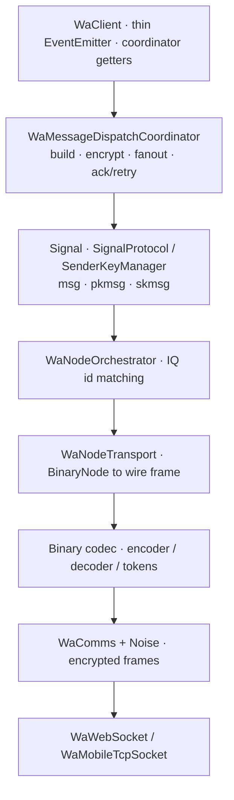
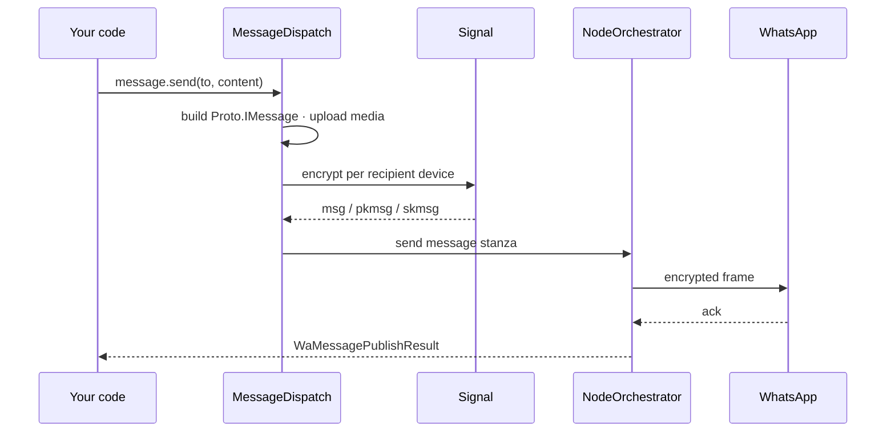

Esta página vai mais fundo que a [visão geral da arquitetura](/pt-br/concepts/architecture) — entrando nos subsistemas e fluxos de dados dentro do `zapo`. É voltada para contribuidores e para qualquer pessoa depurando no nível do protocolo. Para o protocolo em si, veja [O protocolo do WhatsApp](/pt-br/concepts/protocol).

## Mapa de módulos {#module-map}

<Tree>
  <Tree.Folder name="src" defaultOpen>
    <Tree.Folder name="client">
      <Tree.File name="WaClient.ts" />
      <Tree.File name="WaClientFactory.ts" />
      <Tree.Folder name="coordinators" />
    </Tree.Folder>
    <Tree.Folder name="transport">
      <Tree.Folder name="noise" />
      <Tree.Folder name="binary" />
      <Tree.Folder name="node" />
    </Tree.Folder>
    <Tree.Folder name="signal" />
    <Tree.Folder name="crypto" />
    <Tree.Folder name="message" />
    <Tree.Folder name="appstate" />
    <Tree.Folder name="store" />
    <Tree.Folder name="auth" />
    <Tree.Folder name="media" />
    <Tree.Folder name="retry" />
    <Tree.Folder name="protocol" />
    <Tree.Folder name="infra" />
    <Tree.Folder name="util" />
  </Tree.Folder>
</Tree>

| Diretório | Responsabilidade |
| --- | --- |
| `src/client/` | Orquestração do client, coordinators, ciclo de vida da conexão, roteamento de eventos. |
| `src/transport/` | Socket, handshake Noise, codec de binary node, orquestração de node. |
| `src/signal/` | Sessões Signal, ratchet (1:1), sender keys (grupos), geração de chaves. |
| `src/crypto/` | Primitivas: AES-GCM/CBC/CTR, SHA, HMAC, HKDF, Curve25519/Ed25519. |
| `src/message/` | Pipeline de build/encode de saída + parse/decrypt de entrada. |
| `src/appstate/` | Engine de sincronização de app-state (mutations, snapshots, crypto, MACs). |
| `src/store/` | Contratos de store + providers em memória; fronteira de persistência. |
| `src/auth/` | Fluxos de pareamento/QR/credenciais. |
| `src/media/` | Upload/download/criptografia de mídia. |
| `src/retry/` | Rastreamento de retry para envios/descriptografias que falharam. |
| `src/protocol/` | Constantes (node tags, tipos de IQ, xmlns) e helpers de JID. |
| `src/infra/` | Logging, coleções limitadas, locks, utilitários de performance. |
| `src/util/` | Helpers de byte/async/primitivas. |

## A stack {#the-stack}

As stores atravessam todas as camadas; o connection manager e o keep-alive ficam ao lado do transporte.

## Ciclo de vida da conexão {#connection-lifecycle}

O `WaConnectionManager` (em `src/client/connection/`) conduz o connect/disconnect:

1. O `WaComms` abre o socket (`WaWebSocket` ou `WaMobileTcpSocket`) e executa o handshake **Noise** (`src/transport/noise/`), autenticando o servidor e derivando as chaves de sessão.
2. O `WaNodeTransport.bindComms()` anexa o codec binário ao socket criptografado.
3. O `WaKeepAlive` (`src/transport/keepalive/`) inicia ping IQs periódicos para detectar um socket morto e estimar o desvio do relógio do servidor.
4. O client executa tarefas passivas pós-conexão (history sync, drenagem de mensagens offline) e emite [`connection`](/pt-br/concepts/events#auth--connection).

O `zapo` deliberadamente **não** reconecta automaticamente — essa política pertence ao seu app (veja [Reconexão](/pt-br/guides/reconnection)).

## Pipeline de mensagem de saída {#outgoing-message-pipeline}

`client.message.send` → `WaMessageDispatchCoordinator`:

1. **Build** — o conteúdo (a [send union](/pt-br/reference/message-types)) é construído em um `Proto.IMessage`, fazendo upload da mídia se necessário.
2. **Resolver dispositivos** — a lista de dispositivos do destinatário é resolvida (fanout, `src/client/messaging/`), buscando prekey bundles para dispositivos sem sessão.
3. **Criptografar** — por dispositivo: 1:1 via o ratchet Signal (`SignalProtocol` → `msg`/`pkmsg`), grupos via `SenderKeyManager` (`skmsg`) mais a distribuição de sender-key aos membros que precisam. Seus próprios dispositivos recebem um `deviceSentMessage`.
4. **Montar** — `src/transport/node/builders/message.ts` envolve os participantes criptografados em uma única stanza `<message>` com a identidade do dispositivo, o hash de participantes e o `addressing_mode` (pn/lid).
5. **Enviar e ack** — `WaNodeOrchestrator.sendNode()` codifica e escreve; o coordinator aguarda o `<ack>` do servidor e retorna um [`WaMessagePublishResult`](/pt-br/guides/sending-messages). Falhas são reenviadas conforme as tentativas/backoff configurados.

## Pipeline de entrada {#incoming-pipeline}

1. O `WaComms` descriptografa um frame Noise; o `WaNodeTransport.dispatchIncomingFrame()` o decodifica em um `BinaryNode`.
2. O `WaIncomingNodeCoordinator` roteia por tag/type para o handler certo (`src/client/events/`).
3. Para mensagens, o corpo é descriptografado (ratchet Signal ou sender key), os wrappers de device-sent são desembrulhados e o padding PKCS7 é removido (`src/message/primitives/incoming.ts`).
4. O resultado é normalizado em um payload tipado e emitido (`message`, `receipt`, `group`, …). Um [filtro de stanza](/pt-br/reference/low-level#filtering-inbound-stanzas) pode descartar stanzas antes que os handlers rodem; o coordinator ainda dá ack em `message`/`receipt`/`notification` para que o servidor pare de reentregar.

Falhas de descriptografia são rastreadas e podem disparar um retry-receipt para que o remetente recriptografe.

## Engine de app-state {#app-state-engine}

O `WaAppStateSyncClient` (`src/appstate/`) reconcilia as configurações por conta:

- Uma sincronização envia a última versão conhecida por coleção; o servidor retorna **patches** (ou um **snapshot** completo).
- O índice e o valor de cada mutation são verificados por MAC e o valor é descriptografado (`WaAppStateCrypto`: AES-CBC + HMAC, chaves por coleção derivadas via HKDF).
- As mutations verificadas são aplicadas à store `appState` e expostas como eventos [`mutation`](/pt-br/concepts/events#state-history--mex).
- **Sink de contatos** — mutations `Contact` vencedoras (incluindo as de snapshot em pair-time) fluem incondicionalmente para a store `contacts`, dando bootstrap no address book no primeiro connect independente do toggle público `emitSnapshotMutations`. O sink resolve o JID LID-canonical a partir de `contactAction.lidJid`, espelha a forma PN em `phoneNumber` e escreve `fullName ?? firstName` como `displayName`. O history-sync adicionalmente persiste `inlineContacts` e `displayName` / `username` por conversation quando o primary device os encaminha; o payload de pair anuncia `supportInlineContacts` para que o servidor saiba enviá-los.
- Mudanças de saída de [`client.chat`](/pt-br/reference/chat-mutations) são codificadas como mutations, agrupadas em lote e descarregadas.

## Camada de store {#store-layer}

A store é dividida em **contratos** (`src/store/contracts/` — a interface que cada domínio implementa) e **providers** (o provider `memory` embutido, mais os [pacotes de backend](/pt-br/reference/stores) externos). É isso que permite misturar backends por domínio em [`createStore`](/pt-br/concepts/stores).

Duas fronteiras de performance ficam aqui:

- **Write-behind** — mensagens/threads/contatos de entrada são agrupados em lote e descarregados de forma assíncrona (ajustado via [`writeBehind`](/pt-br/concepts/configuration#write-behind-persistence)) para que o caminho quente não fique bloqueado no banco de dados.
- **Caches limitados** — `retry`, `groupMetadata`, `deviceList` e `messageSecret` são limitados em memória com TTLs para evitar crescimento ilimitado em processos de longa duração.

## Confiabilidade {#reliability}

- **Retry tracker** (`src/retry/`) — mapeia ids de mensagens que falharam para metadados de retry e impõe limites de tentativa/backoff.
- **Fila de recibos** (`WaReceiptQueue`) — armazena recibos que falham ao enviar durante uma desconexão, reproduzindo-os na reconexão (limitada para evitar crescimento).
- **Keep-alive** — ping IQs periódicos detectam sockets mortos e medem o desvio do relógio; ele pula o ping enquanto uma query já está em andamento.

## Composição do client {#client-composition}

O `WaClientFactory` é a raiz de composição: ele constrói o auth client, o connection manager, o transporte + orchestrator, o keep-alive, os managers de Signal/sender-key, o app-state client, as stores e cada coordinator de funcionalidade, e então os injeta no `WaClient`. O `WaClient` em si permanece enxuto — um `EventEmitter` que expõe os getters de coordinator e o ciclo de vida da conexão.

## Crypto {#crypto}

O `src/crypto/` fornece as primitivas:

- **Simétrica** — AES-GCM (Noise, valores de app-state), AES-CBC (sender keys), AES-CTR (mídia).
- **Hash/MAC/KDF** — SHA-1/256/512, HMAC, HKDF.
- **Curva elíptica** — Curve25519 (X25519 DH) e assinaturas Ed25519/XEdDSA.

Tudo aqui é **síncrono exceto as operações de curva elíptica**, que são assíncronas. Manter o resto da criptografia síncrono removeu o overhead assíncrono por chamada e melhorou de forma mensurável a vazão nos caminhos quentes; as operações de curva permanecem assíncronas por design.

## Convenções {#conventions}

Estas valem em todo o código-fonte e explicam boa parte do formato da API:

- `Uint8Array` em todo lugar para dados binários; `Buffer` é evitado. Zero-copy (`subarray`, byte views) nos caminhos críticos.
- Estruturas em memória limitadas para evitar crescimento ilimitado.
- Apenas named exports; sem default exports.
- Sem enums — as constantes usam `Object.freeze({ … } as const)`, expostas como os objetos `WA_*`.
- Path aliases (`@client`, `@crypto`, `@store`, …) em vez de imports relativos `../`.
