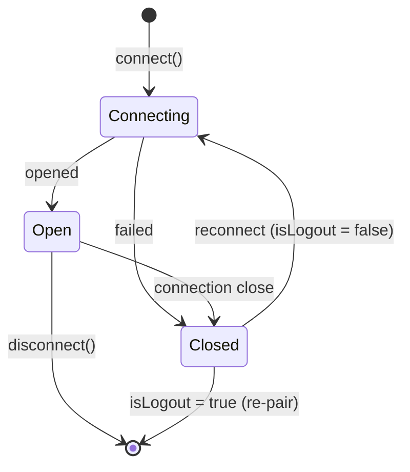

<Warning>
  O `WaClient` **não** reconecta automaticamente. Esta é uma escolha de design deliberada: a política de reconexão (backoff, máximo de tentativas, alertas) pertence à sua aplicação. Você escuta o `connection: close` e decide o que fazer.
</Warning>

## Ciclo de vida da conexão {#connection-lifecycle}



## O evento connection {#the-connection-event}

`connection` é uma union discriminada por `status`:

```ts
client.on('connection', (event) => {
  if (event.status === 'open') {
    console.log('connected', { isNewLogin: event.isNewLogin })
    return
  }

  // status === 'close'
  console.log('disconnected', {
    reason: event.reason,
    code: event.code,
    isLogout: event.isLogout
  })
})
```

Em `close`:

- **`isLogout: true`** — o dispositivo foi desvinculado (logout no servidor). **Não** reconecte; as credenciais se foram e você precisa parear novamente.
- **`isLogout: false`** — uma queda transitória. É seguro reconectar com as credenciais armazenadas.

## Um loop de reconexão com backoff {#a-reconnection-loop-with-backoff}

```ts
const MAX_ATTEMPTS = 10

async function connectWithRetry(client: WaClient) {
  let attempt = 0

  client.on('connection', (event) => {
    if (event.status === 'open') {
      attempt = 0 // reseta o backoff em uma conexão saudável
      return
    }
    if (event.isLogout) {
      console.error('logged out — re-pairing required')
      return
    }
    void reconnect()
  })

  async function reconnect() {
    if (attempt >= MAX_ATTEMPTS) {
      console.error('giving up after', attempt, 'attempts')
      return
    }
    const delayMs = Math.min(30_000, 1_000 * 2 ** attempt)
    attempt += 1
    console.log(`reconnecting in ${delayMs}ms (attempt ${attempt})`)
    await new Promise((r) => setTimeout(r, delayMs))
    try {
      await client.connect()
    } catch (err) {
      console.error('reconnect failed', err)
      void reconnect()
    }
  }

  await client.connect()
}
```

## Recuperando de `client_too_old` (HTTP 405) {#recovering-from-client-too-old}

Se o servidor começar a rejeitar o handshake noise com `failure_client_too_old`, a versão embarcada do WA Web está desatualizada. Duas opções:

- Ative [`recoverFromClientTooOld: true`](/pt-br/concepts/configuration#whatsapp-web-version) no `WaClient` — a cada 405 o client busca a versão atual em `web.whatsapp.com`, troca em memória e reconecta.
- Passe um [resolver `version`](/pt-br/concepts/configuration#whatsapp-web-version) que retorne uma string fresca por conexão.

Ambos são paliativos — atualize o zapo quando uma release trouxer um default mais novo.

## Depois de reconectar {#after-reconnecting}

Parte do estado é **escopado à conexão** e precisa ser reestabelecido após uma reconexão bem-sucedida:

- **Assinaturas de presença** — faça `subscribe()` novamente em qualquer contato que você estava observando ([Presença](/pt-br/guides/presence-status#subscribing-to-a-contact)).
- **Atualizações ao vivo de newsletter** — faça `subscribeLiveUpdates()` novamente se você depende delas.

O estado persistido (credenciais, sessões do Signal, [app-state](/pt-br/reference/glossary#app-state)) é restaurado da [store](/pt-br/concepts/stores) automaticamente — você **não** pareia novamente em uma reconexão normal.

## Encerramento gracioso {#graceful-shutdown}

Chame `disconnect()` para um encerramento limpo que mantém as credenciais, para que você possa retomar mais tarde:

```ts
process.on('SIGINT', async () => {
  await client.disconnect()
  process.exit(0)
})
```

Isso descarrega os dados pendentes de write-behind e fecha o socket sem desvincular o dispositivo.
