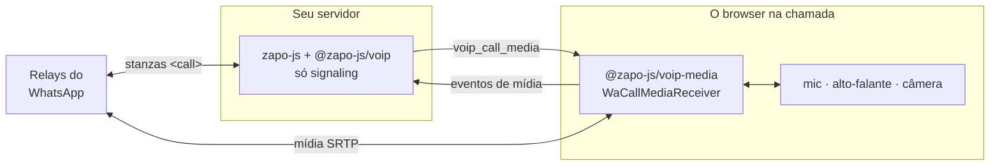

Por padrão a mídia de uma chamada — as legs de relay, SRTP, o codec, o jitter buffer e o clock de áudio — roda no mesmo processo do [plugin de VoIP](/pt-br/guides/voip). Esse é o formato certo para um bot: o áudio é sintetizado e consumido onde o signaling está.

É o formato errado quando tem uma **pessoa** na chamada. O microfone está no browser dela, e rotear esse áudio pelo seu servidor para ser codificado lá adiciona um salto, uma dependência de codec e um build nativo a uma máquina que só precisa falar o protocolo.

O `media: { mode: 'remote' }` separa os dois. O signaling fica no servidor; a mídia roda onde o áudio está, sobre o **`@zapo-js/voip-media`** — um package sem dependência de `zapo-js` e sem dependência de Node, que roda num browser como está.



<Note>
  **Nenhuma mídia passa pelo seu servidor.** O browser fala direto com os relays do WhatsApp; o servidor só entrega o plano para fazer isso. Por isso ele não precisa nem de `@roamhq/wrtc` nem de `libmlow-wasm-fork`.
</Note>

## Instalação {#install}

No servidor, nada novo — só largue as peers de mídia:

```bash
npm install zapo-js @zapo-js/voip
```

No browser:

```bash
npm install @zapo-js/voip-media libmlow-wasm-fork
```

O `@zapo-js/voip-media` já é uma dependência do `@zapo-js/voip`, então o servidor o tem transitivamente; no browser você o instala como dependência direta do bundle. As duas peers dele são **opcionais**:

| Package | Necessário para |
| --- | --- |
| `libmlow-wasm-fork` (`^0.2.0`) | O codec MLow. Obrigatório onde a mídia roda de fato. |
| `@roamhq/wrtc` (`>= 0.10.0`) | O transporte de relay **só no Node**. Um browser usa o próprio `RTCPeerConnection`. |

<Warning>
  O browser precisa de um **contexto seguro** — HTTPS ou `localhost`. Tanto o microfone (`getUserMedia`) quanto o `AudioWorklet` dependem disso.
</Warning>

## A divisão {#the-split}

O que fica no servidor e o que se muda:

| | Servidor (`@zapo-js/voip`) | Host de mídia (`@zapo-js/voip-media`) |
| --- | --- | --- |
| Stanzas `<call>`, offer/accept/terminate | ✅ | |
| Estado da chamada, `CallInfo`, eventos `voip_*` | ✅ | |
| Mute, levantar a mão, screen share, upgrade de vídeo | ✅ | |
| Legs de relay, STUN, SRTP | | ✅ |
| Encode/decode MLow, jitter buffer | | ✅ |
| Packetize/depacketize H.264 | | ✅ |
| Microfone, alto-falante, câmera | | ✅ |
| Reações com emoji (in-band no socket de mídia) | | ✅ |

Por causa dessa divisão, isto lança ou fica em silêncio no servidor com mídia remota:

<Warning>
  Com `media: { mode: 'remote' }`, `loadAudio`, `setExternalAudioMode` e `feedLiveAudio` **lançam**; `sendReaction` retorna `false`; `feedLiveVideo` retorna `0`; e `voip_call_inbound_audio` / `voip_call_inbound_video` / `voip_call_inbound_video_rtp` **nunca disparam**. Áudio, vídeo e reações vivem no host de mídia.
</Warning>

Todo o resto da chamada — aceitar, encerrar, eventos de estado, mute, mãos, screen share, upgrades — fica exatamente onde estava.

## Conectando o lado servidor {#wiring-the-server-side}

Duas linhas ligam o plugin ao transporte que você roda entre servidor e browser:

```ts
import { WaClient } from 'zapo-js'
import { voipPlugin } from '@zapo-js/voip'
import { decodeCallMediaEvent, encodeCallMediaMessage } from '@zapo-js/voip-media'

const client = new WaClient({
  store,
  sessionId: 'main',
  plugins: [voipPlugin({ media: { mode: 'remote' } })]
}, logger)

// servidor → browser: cada mudança no plano de mídia da chamada
client.on('voip_call_media', ({ message }) => {
  browserSocket.send(encodeCallMediaMessage(message))
})

// browser → servidor: o que o host de mídia reporta de volta
browserSocket.on('message', (text) => {
  client.voip.media.handleEvent(decodeCallMediaEvent(text))
})
```

<Warning>
  **O plano carrega as chaves SRTP e as credenciais de relay da chamada.** `WaCallMediaMessage.plan.keys` e as credenciais dentro de `plan.relays` são segredos: o canal até o host de mídia precisa ser privado daquele host e criptografado em trânsito. Nunca logue uma mensagem de plano, nunca persista uma, e nunca faça broadcast dela para uma sala.
</Warning>

### Um host que entra atrasado {#a-host-that-joins-late}

Um browser que conecta depois da chamada ter começado — um reload, uma segunda aba assumindo — perdeu todas as mensagens até ali. O `snapshot` entrega a ele o plano inteiro como está:

```ts
const snapshot = client.voip.media.snapshot(callId)
if (snapshot) browserSocket.send(encodeCallMediaMessage(snapshot))
```

Retorna `null` para uma chamada desconhecida, ou quando a mídia é local. O host também pede isso por conta própria — veja [resync](#ordering-gaps-and-resync).

### `client.voip.media` {#clientvoipmedia}

| Membro | Assinatura | O que faz |
| --- | --- | --- |
| `handleEvent` | `(message: WaCallMediaEventMessage) => void` | Entrega um evento que o host de mídia mandou de volta, como chegou. |
| `snapshot` | `(callId: string) => WaCallMediaMessage \| null` | O plano de mídia inteiro da chamada como está. `null` para chamada desconhecida ou mídia local. |

## O protocolo de fio {#the-wire-protocol}

Dois tipos de mensagem trafegam, ambos JSON puro com um campo de versão. O zapo te dá os codecs; o transporte é seu — um WebSocket, um stream SSE mais uma rota POST, uma fila de mensagens, qualquer coisa mais ou menos ordenada.

### Servidor → host: `WaCallMediaMessage` {#server-host-wacallmediamessage}

```ts
interface WaCallMediaMessage {
  readonly v: 1            // WA_CALL_MEDIA_WIRE_VERSION
  readonly callId: string
  readonly seq: number     // por chamada, a partir de 0
  readonly full: boolean   // true = plano inteiro, false = só o que mudou
  readonly plan: WaCallMediaPlanUpdate
}
```

O plano é a descrição de mídia que o host precisa: `keys` (material SRTP), `relays` (endpoints e credenciais), `ssrcs`, `settings` e `video`. Uma mensagem `full` carrega tudo; as outras carregam só as seções que mudaram.

### Host → servidor: `WaCallMediaEventMessage` {#host-server-wacallmediaeventmessage}

```ts
interface WaCallMediaEventMessage {
  readonly v: 1
  readonly callId: string
  readonly event: WaCallMediaEvent
}
```

| `event.type` | Payload | Significado |
| --- | --- | --- |
| `'active'` | — | A mídia começou a fluir: a chamada foi aceita e uma leg de relay está no ar. |
| `'relay_lost'` | `reason: string` | Não resta nenhuma leg de relay. O signaling encerra a chamada ([`EndCallReason.RelayLost`](/pt-br/guides/voip#endcallreason)). |
| `'reaction'` | `reaction: WaCallReaction` | Uma reação com emoji in-band chegou do peer. |
| `'resync'` | `lastSeq: number \| null` | O host perdeu uma mensagem e precisa do plano inteiro de novo. |

### Codificação {#encoding}

```ts
import {
  encodeCallMediaMessage, decodeCallMediaMessage,
  encodeCallMediaEvent,   decodeCallMediaEvent
} from '@zapo-js/voip-media'
```

Cada `encode*` retorna uma `string` e cada `decode*` recebe uma. JSON não tem tipo binário nem `bigint`, então a codificação marca os dois: arrays de bytes viajam sob `$bytes` (base64) e o transaction id `uint64` de uma reação sob `$bigint`. **Sempre passe por essas funções** — um `JSON.stringify` feito à mão perde as chaves SRTP e o transaction id.

O `WA_CALL_MEDIA_WIRE_VERSION` é `1`. Só uma mudança quebradora o move; um campo novo é opcional.

### Ordem, lacunas e resync {#ordering-gaps-and-resync}

O `WaCallMediaReceiver` aplica as mensagens uma de cada vez, na ordem da chamada, e guarda o último `seq` que aceitou:

- Uma mensagem **mais antiga** que a última aceita é descartada.
- Uma lacuna (`seq > lastSeq + 1`) emite um evento `resync` carregando `lastSeq`. Responda com `snapshot(callId)`.
- Uma mensagem `full` é aceita sempre que o `seq` dela não está atrasado, o que é o que faz a resposta de snapshot funcionar.
- Uma mensagem cuja aplicação **rejeita** não conta como recebida, então a próxima encontra a lacuna e pede resync sozinha.

Você não precisa implementar nada disso — é trabalho do receiver. Você só precisa responder ao `resync` com um snapshot.

## O browser {#the-browser}

### Áudio {#audio}

A chamada mínima viável. Construa o receiver, comece a escutar, e então abra o áudio a partir de um gesto do usuário:

```ts
import {
  decodeCallMediaMessage,
  encodeCallMediaEvent,
  WaCallMediaReceiver
} from '@zapo-js/voip-media'
import { WaWebCallAudio, webMediaHost } from '@zapo-js/voip-media/web'

const receiver = new WaCallMediaReceiver({
  ...webMediaHost,
  callId,
  send: (event) => socket.send(encodeCallMediaEvent(event))
})

// Escute ANTES de qualquer await: um plano que chegasse nesse meio-tempo se perderia.
socket.onmessage = (event) => receiver.receive(decodeCallMediaMessage(event.data))

await receiver.start()   // carrega o codec

let audio: WaWebCallAudio | undefined

answerButton.onclick = async () => {
  // Abre mic e alto-falante. Precisa rodar dentro do gesto.
  audio = await WaWebCallAudio.start(receiver.plane)
  // O accept em si fica no servidor:
  await fetch(`/calls/${callId}/accept`, { method: 'POST' })
}

// quando voip_call_ended chegar ao browser:
await audio?.stop()
receiver.stop()
```

<Warning>
  Registre o listener do socket **antes** do primeiro `await`. O `receiver.start()` carrega o codec WASM, e uma mensagem de plano que chegar durante esse await sem listener registrado simplesmente se perde — o receiver depois vai ver a lacuna e pedir resync, mas você pagou um round-trip à toa.
</Warning>

<Tip>
  Chame `WaWebCallAudio.start` de dentro do handler de clique, não depois de um `await` que escape do gesto. O `AudioContext` é criado e retomado antes do primeiro `await` internamente, mas o gesto precisa ainda estar vivo quando você chamar, ou o `getUserMedia` e o contexto podem travar.
</Tip>

O accept fica no servidor de propósito: ele é uma stanza `<call>`, e só o servidor fala o protocolo. O clique que atende pede o accept ao servidor e abre o áudio localmente; as duas coisas acontecem juntas.

#### `WaWebCallAudio` {#wawebcallaudio}

O `WaWebCallAudio.start(sink, options?)` carrega o áudio entre o microfone e o alto-falante do browser e um sink — o `receiver.plane` satisfaz esse sink. O **clock do dispositivo de áudio ritma as duas direções**, então uma aba em segundo plano estrangulada não deixa a chamada sem áudio.

<ParamField path="microphone" type="MediaStream">
  Microfone a capturar. Padrão: `getUserMedia` com cancelamento de eco, supressão de ruído e ganho automático — o codec não faz nenhum dos três, eles vêm do browser. Um stream que você passa **não** é parado pelo `stop()`.
</ParamField>

<ParamField path="audioContext" type="AudioContext">
  Contexto em que rodar. Padrão: um `AudioContext` novo de 16 kHz, caindo para a taxa do dispositivo se o browser recusar. Um contexto que você passa não é fechado nem retomado pelo `stop()`.
</ParamField>

<ParamField path="workletUrl" type="string">
  URL do módulo do worklet. Padrão: uma Blob URL. Sob uma CSP que proíbe `blob:`, sirva o `WA_CALL_AUDIO_WORKLET_SOURCE` exportado como arquivo e passe a URL dele aqui.
</ParamField>

O `stop()` libera apenas o que o adapter adquiriu, e uma chamada repetida retorna a mesma promise.

<Note>
  O Firefox recusa um microfone numa sample rate estrangeira. O adapter lida com isso: se ele é dono do contexto e a taxa de 16 kHz é recusada, ele reabre na taxa do dispositivo e tenta de novo.
</Note>

### Vídeo {#video}

Construa o receiver com `onInboundVideo` para os frames do peer, e entregue ao plane um track de câmera para os seus:

```ts
import { WaWebCallVideoReceiver, WaWebCallVideoSender } from '@zapo-js/voip-media/web'

const video = new WaWebCallVideoReceiver({
  onFrame: (frame, ssrc) => {
    context2d.drawImage(frame, 0, 0)
    frame.close()          // o frame é seu para fechar
  }
})

const receiver = new WaCallMediaReceiver({
  ...webMediaHost,
  callId,
  send: (event) => socket.send(encodeCallMediaEvent(event)),
  onInboundVideo: (frame) => video.push(frame)
})

const [camera] = (await navigator.mediaDevices.getUserMedia({ video: true })).getVideoTracks()
const sender = await WaWebCallVideoSender.start(receiver.plane, camera)

// quando a chamada acabar, junto com o áudio:
await sender.stop()
camera.stop()
video.close()
```

Os dois lados usam **WebCodecs**. O `WaWebCallVideoSender.start` lança quando o browser não tem `VideoEncoder`, ou quando você entrega um track que não é de vídeo.

<Warning>
  O `onFrame` te entrega um `VideoFrame` que **você** precisa dar `close()`. Um frame esquecido prende memória de GPU, e alguns segundos disso travam o decoder.
</Warning>

#### Opções do `WaWebCallVideoSender` {#wawebcallvideosender-options}

| Opção | Padrão | Notas |
| --- | --- | --- |
| `frameRate` | `15` | Máximo de frames por segundo codificados; uma fonte mais rápida é afinada (com folga de 20%, para uma fonte exatamente na taxa não cair pela metade). |
| `bitrate` | `600_000` | Alvo do encoder, bits por segundo. |
| `keyFrameIntervalMs` | `2000` | Maior intervalo entre key frames. Pedidos de key frame **não são atendidos**, então só isso limita quanto um receptor espera depois de uma perda. |
| `codec` | `'avc1.42E01F'` | String de codec do WebCodecs — Constrained Baseline 3.1. |
| `hardwareAcceleration` | escolha do browser | Como o WebCodecs recebe. |
| `onError` | — | Uma falha do encoder. O frame seguinte constrói um encoder novo, começando num key frame. |

O `sender.stats` reporta `framesCaptured`, `framesEncoded`, `framesSent`, `framesDropped`, `packetsSent`, `keyFrames`, `width`, `height`.

#### Opções do `WaWebCallVideoReceiver` {#wawebcallvideoreceiver-options}

| Opção | Padrão | Notas |
| --- | --- | --- |
| `onFrame` | **obrigatório** | `(frame: VideoFrame, ssrc: number) => void`. Seu para fechar. |
| `hardwareAcceleration` | escolha do browser | Um decoder de hardware pode bufferizar vários frames antes da primeira saída; `'prefer-software'` evita essa latência. |
| `onError` | — | Uma falha do decoder. O stream retoma no key frame seguinte. |

O `receiver.stats` reporta `framesReceived`, `framesDecoded`, `framesDropped` (antes do primeiro key frame, ou depois de uma falha), `decodeErrors`, e `codec` — lido do sequence parameter set do último stream decodificado.

### `webMediaHost` {#webmediahost}

Espalhar `...webMediaHost` nas opções do receiver fornece as duas primitivas de plataforma que o plane de mídia precisa num browser:

- `crypto` — `webCrypto`, construído sobre o próprio `crypto.subtle` do browser.
- `createPeerConnection` — `createBrowserPeerConnection`, o próprio `RTCPeerConnection` do browser. Uma configuração que o browser recusa rejeita a promise.

Não existem legs UDP cruas num browser, então `useRawUdpTransport` não tem significado lá.

## `WaCallMediaReceiver` {#wacallmediareceiver}

```ts
const receiver = new WaCallMediaReceiver(options)
```

| Membro | Assinatura | Notas |
| --- | --- | --- |
| `plane` | `WaCallMediaPlane` | O plane de mídia em si — ao que `WaWebCallAudio` e `WaWebCallVideoSender` se conectam. |
| `start()` | `Promise<void>` | Carrega o codec. |
| `receive(message)` | `Promise<void>` | Aplica uma mensagem, uma de cada vez na ordem da chamada. |
| `stop()` | `WaCallMediaStats` | Desmonta o plane e retorna as estatísticas de mídia da chamada. |

As opções estendem as do próprio plane, mais:

<ParamField path="callId" type="string" required>
  A chamada que este receiver serve. Uma mensagem para outro call id rejeita.
</ParamField>

<ParamField path="send" type="(message: WaCallMediaEventMessage) => void" required>
  Entrega um evento de volta ao signaling, pelo transporte que você roda.
</ParamField>

<ParamField path="onReaction" type="(reaction: WaCallReaction) => void">
  Também é informado das reações que vão para o signaling, para um host que queira renderizá-las.
</ParamField>

<ParamField path="onInboundVideo" type="(frame: InboundVideoFrame) => void">
  Uma access unit H.264 remontada de um stream de vídeo do peer, indexada por `frame.ssrc`.
</ParamField>

<ParamField path="onInboundVideoRtp" type="(packet: InboundVideoRtpPacket) => void">
  Cada pacote RTP de vídeo de entrada decriptado, antes da remontagem.
</ParamField>

<ParamField path="logger" type="Logger">
  Opcional. O `createNoopLogger()` é exportado para quando você quer o formato sem a saída.
</ParamField>

<Note>
  `onActive` e `onRelayLost` **não** são seus para definir — o receiver é dono deles e os transforma nos eventos `active` e `relay_lost` que manda de volta ao signaling.
</Note>

### Estatísticas da chamada {#call-statistics}

O `stop()` retorna `WaCallMediaStats`, que é o que logar quando uma chamada soou errada:

| Grupo | Campos |
| --- | --- |
| Relay | `relayPackets` |
| Áudio de saída | `audioSent`, `audioDropped`, `audioTimelineResyncs`, `audioFramesShed`, `audioCaptureSkewMs` |
| Áudio de entrada | `audioReceived`, `decoded`, `decodeErrors`, `playout` (stats do jitter buffer) |
| SRTP | `srtpErrors` (a soma), `srtpReplays`, `srtpAuthFailures`, `srtpOtherErrors` |
| Vídeo | `videoFramesSent`, `videoPacketsReceived`, `videoFecDiscarded` |

<Tip>
  O `audioCaptureSkewMs` é o instante da captura menos o timestamp do último frame de áudio enviado: positivo significa que a timeline está atrasada. Uma subida constante ali é um host que não consegue acompanhar o clock, não um problema de rede.
</Tip>

## Mídia num segundo processo Node {#media-on-a-second-node-process}

O browser é o caso comum, mas nada na divisão é específico de browser. Um segundo processo Node é a mesma ligação, com o host de Node e as peers de Node instaladas lá:

```ts
import { WaCallMediaReceiver } from '@zapo-js/voip-media'
import { nodeMediaHost } from '@zapo-js/voip-media/node'
```

O `nodeMediaHost` fornece `nodeCrypto` (`node:crypto`) e `createWrtcPeerConnection` (`@roamhq/wrtc`). Esse host precisa de `@roamhq/wrtc` e `libmlow-wasm-fork`, exatamente como um servidor com mídia local — as dependências seguem a mídia, não o signaling.

Legs UDP cruas ficam desligadas lá também; um host que as queira passa a factory de leg explicitamente:

```ts
import { nodeMediaHost, WaRawUdpLeg } from '@zapo-js/voip-media/node'

const receiver = new WaCallMediaReceiver({
  ...nodeMediaHost,
  createRawUdpLeg: (options) => new WaRawUdpLeg(options),
  callId,
  send: (event) => socket.send(encodeCallMediaEvent(event))
})
```

Leia o aviso sobre [`useRawUdpTransport`](/pt-br/guides/voip#plugin-options) antes de fazer isso — é um experimento, não um botão de tuning.

## Veja também {#see-also}

<CardGroup cols={2}>
  <Card title="Chamadas (VoIP)" icon="phone" href="/pt-br/guides/voip" arrow>
    O lado do signaling: fazer e atender chamadas, mute, mãos, screen share, upgrades de vídeo.
  </Card>
  <Card title="Sistema de plugins" icon="puzzle-piece" href="/pt-br/concepts/plugins" arrow>
    Como o `voipPlugin()` se conecta ao `WaClient`.
  </Card>
</CardGroup>
