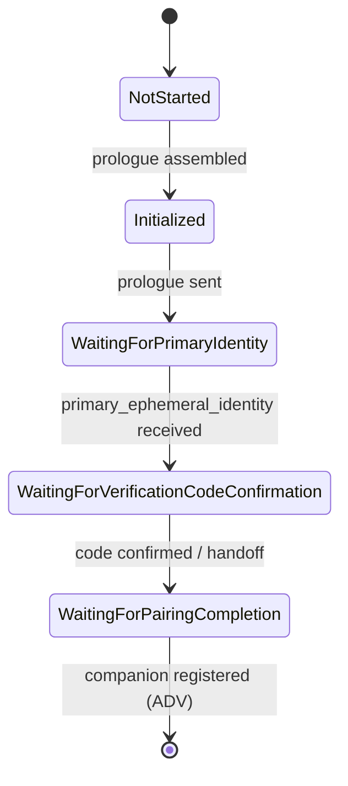
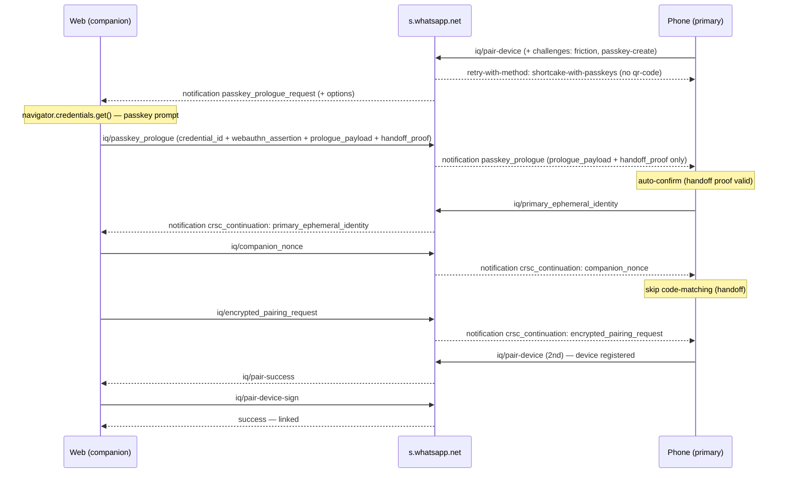

O WhatsApp está lançando o **linking de dispositivos travado por passkey**: para algumas contas o servidor recusa o fluxo normal de QR / código de pareamento e exige uma **assertion de passkey WebAuthn** antes de um companion vincular. Os clients oficiais chamam esse fluxo de **Shortcake** (lado web) e **CRSC** — *Companion Registration over Side Channel* (lado telefone).

Esta página documenta esse fluxo como foi feita a engenharia reversa a partir do bundle do WhatsApp Web e do app Android decompilado, e então validado contra uma captura ao vivo, correlacionada por pacote, de um linking real. Está aqui para os curiosos e para contribuidores que precisam entender por que uma conta travada por passkey se comporta de forma diferente.

<Note>
  O `zapo` é uma implementação **independente e feita do zero** do protocolo do WhatsApp e **não é afiliado, endossado ou conectado ao WhatsApp ou à Meta**. Tudo aqui é pesquisa de interoperabilidade derivada de observar clients publicamente distribuídos na rede (on the wire). Todos os identificadores, chaves, assinaturas e dados de conta reais da captura original foram **redigidos** e substituídos por placeholders.
</Note>

<Warning>
  **Não existe bypass headless.** A conclusão recorrente — estabelecida empiricamente, não apenas inferida — é que numa conta travada por passkey, vincular um companion exige uma assertion do **próprio authenticator do dono da conta**. Esta página explica *por que* o muro se sustenta, para você entender o limite em vez de perder tempo procurando um buraco que não existe.
</Warning>

## Visão geral dos fluxos de passkey {#overview-of-the-passkey-flows}

Passkeys tocam várias superfícies distintas. A que importa para uma biblioteca companion é o **linking**; o resto está listado por completude.

| Fluxo | Lado | O que o passkey faz |
| --- | --- | --- |
| **Linking Shortcake** | Web (companion) | Vincular um companion usando uma assertion de passkey em vez de escanear o QR. |
| **Integrity checkpoint** | Web (companion) | Challenge de sessão anti-abuso: assertion de passkey **ou** captcha. |
| Login / registro | Mobile (primary) | Passkey no lugar do código SMS. |
| Backup criptografado | Mobile (primary) | Gate + segredo PRF para backups criptografados ponta a ponta. |
| In-thread / settings / criação | Mobile (primary) | Superfícies de gerenciamento e native-auth. |

A assimetria é o modelo mental central:

- O **telefone (primary)** é *dono* do passkey — ele cria, gerencia e usa (login, backup, linking), através do **Credential Manager** do Android com a extensão **PRF** do WebAuthn.
- A **web (companion)** apenas *usa* um passkey — para linking e para o integrity checkpoint.

Criar um passkey na web é o fluxo genérico CAA/Bloks da Meta, **não** um caminho específico do WhatsApp-web, e está fora de escopo aqui.

## Shortcake: vinculando com um passkey {#shortcake-linking-with-a-passkey}

### O gatilho {#the-trigger}

O prólogo de passkey é **server-driven**. Não é um botão, e nem uma flag A/B client-side — o companion não consegue iniciá-lo. O servidor empurra uma notification para o lado **web**:

```xml
<notification from="s.whatsapp.net" type="passkey_prologue_request"
    id="«stanza-id»" t="«unix-ts»" offline="0">
  <passkey_request_options>«1..4096 bytes: JSON UTF-8 PublicKeyCredentialRequestOptions»</passkey_request_options>
</notification>
```

- `type="passkey_prologue_request"` é o discriminador literal; `from` tem como default o domain JID `s.whatsapp.net`; `t` e `id` são obrigatórios.
- `<passkey_request_options>` é conteúdo inline opcional (1–4096 bytes) — as request options do WebAuthn como JSON, com `challenge` e cada `allowCredentials[].id` em base64url. Se ausente, o companion as busca com um IQ.
- A web responde com um **ack** de transporte, e então roda o prólogo.

Empiricamente o servidor emite isso **como continuação de um pareamento que seria normal**: numa conta travada ele responde ao `pair-device` do primary com um `retry-with-method` listando `shortcake-with-passkeys` (e, quando não quer fallback, **omite** `qr-code`). O passkey não *substitui* o passo do QR na UI — ele é acoplado depois dele.

<Note>
  O prólogo viaja em **qualquer um dos carriers de linking**. Ele pode seguir o `pair-device` do QR, ou chegar logo após um link por **código de pareamento** — o handshake `companion_hello` → `primary_hello` → `companion_finish` (tratado na web através da notification `link_code_companion_reg`). Em logs capturados o servidor enviou `passkey_prologue_request` cerca de 3 segundos após o `companion_finish`.
</Note>

### A stanza de request do prólogo {#the-prologue-request-stanza}

O `passkey_request_options` inline decodifica para um request `get()` padrão do WebAuthn:

```json
{
  "challenge": "«challenge base64url»",
  "timeout": 600000,
  "rpId": "whatsapp.com",
  "allowCredentials": [],
  "userVerification": "required",
  "extensions": { "uvm": true }
}
```

`allowCredentials: []` significa uma credencial **discoverable** — a conta já tem um passkey, então nenhum credential id precisa ser nomeado. O `rpId` é `whatsapp.com`.

### O prólogo do companion {#the-companion-prologue}

Ao receber o request, o lado web roda uma sequência fixa:

<Steps>
  <Step title="Obter as request options">
    Do conteúdo inline, ou via um IQ se o servidor não as embutiu.
  </Step>
  <Step title="Executar a assertion WebAuthn">
    Decodifica `challenge` / `allowCredentials[].id` de base64url e chama `navigator.credentials.get({ publicKey })`. **Este é o prompt do passkey** — a user verification acontece no dispositivo do dono. Re-encoda `clientDataJSON` / `authenticatorData` / `signature` / `userHandle` de volta para base64url.
  </Step>
  <Step title="Buscar um ref de linking">
    Um IQ `GetRef` retorna a string `ref` que dá escopo a essa sessão de linking.
  </Step>
  <Step title="Inicializar a sessão Shortcake">
    Gera o keypair efêmero, o nonce e o commitment, e monta o `prologue_payload` (veja [criptografia](#the-cryptography)).
  </Step>
  <Step title="Opcionalmente calcular um handoff proof">
    Se uma handoff key estiver disponível (derivada do ADV secret), calcula a prova — ela deixa o *telefone* pular sua UX de confirmação.
  </Step>
  <Step title="Enviar o prólogo">
    Um IQ carrega `credential_id`, `webauthn_assertion`, `prologue_payload` e (opcionalmente) `pairing_handoff_proof`. A web então espera a identidade do primary.
  </Step>
</Steps>

### A state machine de linking {#the-linking-state-machine}

O companion avança por uma pequena state machine, protegida por um timeout de 120 segundos:



- No `primary_ephemeral_identity` o companion revela seu nonce (via um IQ `companion_nonce`), deriva o código de verificação e — a menos que um handoff proof válido tenha deixado os dois lados pularem — mostra o código para conferência.
- A confirmação criptografa o pairing request (AES-GCM) e o envia como `encrypted_pairing_request`.

### A criptografia {#the-cryptography}

Todo o handshake é um ECDH commit-reveal carregado inteiramente em stanzas (porque, ao contrário do QR, não há canal out-of-band carregando as chaves):

| Passo | Construção |
| --- | --- |
| **Keypair + nonce** | Keypair **X25519** efêmero; `companion_nonce` = 32 bytes aleatórios. |
| **Commitment** | O `prologue_payload` carrega a identidade do companion mais `hash = SHA-256(companionEphemeralIdentity ‖ companionNonce)` — comita agora, revela o nonce depois. |
| **Código de verificação** | `a = SHA-256(companionNonce ‖ primaryPubKey)`; `code[0..5] = primaryNonce[0..5] ⊕ a[0..5]`; codificado como **Crockford base32** (5 bytes). |
| **Chave de sessão** | `shared = X25519(companionPriv, primaryPub)`; `HKDF(shared, salt = "Companion Pairing <deviceType> with ref <ref>", info = "Pairing Information Encryption Key", 32)`. |
| **Encrypt** | AES-GCM com um IV aleatório de 12 bytes sobre o plaintext do pairing request. |

O commitment prende o nonce do companion antes do primary responder, então o primary não consegue forçar (grind) um código de verificação escolhido.

### O lado do primary (telefone) {#the-primary-phone-side}

No telefone, o CRSC é a imagem espelhada. Ele recebe o prólogo (repassado pelo servidor), gera sua própria `PrimaryEphemeralIdentity` e deriva o mesmo código. Dois comportamentos valem destaque porque são frequentemente mal interpretados:

- **Auto-confirmação via handoff proof.** Se o companion incluiu um `pairing_handoff_proof` válido — um HMAC sobre o prólogo com chave derivada do ADV secret, condicionado a uma flag A/B do lado telefone, ao app estar em foreground e a uma chave guardada não expirada — o telefone **pula suas próprias telas de confirmar-dispositivo e de conferência de código**.
- **O handoff proof é um atalho do *lado primary*, não um bypass do companion.** Ele remove fricção para o dono do telefone. Ele **não** remove a obrigação do companion de produzir uma `webauthn_assertion` real. No mesmo linking, a web ainda roda `navigator.credentials.get` e envia a assertion; os dois artefatos servem propósitos diferentes.

<Note>
  O servidor valida a `webauthn_assertion` e **não** a repassa ao telefone. O primary recebe apenas `prologue_payload` + `pairing_handoff_proof` — nunca a assertion. Ele confia no handoff proof; o servidor é a parte que checou o passkey.
</Note>

## Passkey vs QR: a sequência de stanzas {#passkey-vs-qr-the-stanza-sequence}

Os dois fluxos convergem para o **mesmo registro ADV** do companion, mas a coreografia difere bastante.

**Passkey (na ótica do web/companion — ◄ recebido / ► enviado):**

| # | Dir | Stanza |
| --- | --- | --- |
| 1 | ◄ | notification `passkey_prologue_request` (+ options inline, opcional) |
| 2 | ► | ack |
| 3 | ► | IQ `GetPasskeyRequestOptions` (só se não veio inline) |
| 4 | ► | IQ `GetRef` |
| 5 | ► | IQ `SetPasskeyPrologue` (`credential_id` + `webauthn_assertion` + `prologue_payload` + handoff proof) |
| 6 | ◄ | notification `primary_ephemeral_identity` |
| 7 | ► | IQ `SetCompanionNonce` (reveal) |
| 8 | ► | IQ `SetEncryptedPairingRequest` |
| 9 | ◄ | conclusão — companion registrado via ADV |

**QR (para contraste):**

| # | Dir | Stanza |
| --- | --- | --- |
| 1 | ◄ | IQ set `pair-device` (lista de `<ref>` para o QR) |
| 2 | ► | IQ result (ack) |
| 3 | — | telefone escaneia o QR (out of band) |
| 4 | ◄ | IQ set `pair-success` (ADV signed device identity + device + platform) |
| 5 | ► | IQ result `pair-device-sign` |
| 6 | — | `stream:error 515` → reconecta com credentials → vinculado |

**A diferença:** o QR são dois IQs para cada lado, o companion só *responde*, e a troca de chave viaja no QR out of band. O passkey tem o companion **iniciando** os IQs e carrega todo o handshake ECDH **em stanzas** — porque não há QR para carregar as chaves.

## Captura de wire correlacionada {#correlated-wire-capture}

Para sair de "reconstruído dos bundles" para "confirmado", o fluxo foi capturado nas **duas pontas de um linking real ao mesmo tempo** — instrumentação ao vivo no telefone (primary) e uma captura de console no WhatsApp Web (companion) — e então correlacionado byte a byte. Todos os valores abaixo estão redigidos.

### Timeline unificada {#unified-timeline}



### O relay CRSC {#the-crsc-relay}

O servidor `s.whatsapp.net` é um **relay**. Cada lado envia um `<iq to="s.whatsapp.net">`; o outro recebe como um `<notification from="s.whatsapp.net">` (`crsc_continuation` / `passkey_prologue`). A prova de que é genuinamente uma sessão: os cinco payloads CRSC são **byte-idênticos** nas duas pontas (a chave X25519 efêmera é aleatória por sessão, então não é coincidência).

| Payload | Web | Telefone | Idêntico |
| --- | --- | --- | --- |
| `prologue_payload` | enviado (iq passkey_prologue) | recv (notif passkey_prologue) | ✓ |
| `pairing_handoff_proof` | enviado | recv | ✓ |
| `primary_ephemeral_identity` | recv (notif crsc) | enviado (iq) | ✓ |
| `companion_nonce` | enviado (iq) | recv (notif crsc) | ✓ |
| `encrypted_pairing_request` | enviado (iq) | recv (notif crsc) | ✓ |

O roteamento funciona porque o IQ `primary_ephemeral_identity` do primary carrega `companion_ref` igual ao `ref` dentro do `prologue_payload`, então o servidor consegue entregá-lo à sessão web correta.

<Note>
  O `passkey_prologue` que o **telefone** recebe contém apenas `prologue_payload` + `pairing_handoff_proof` — **não** a `webauthn_assertion`. O servidor valida a assertion e não a encaminha. A assertion nunca chega ao telefone.
</Note>

### Payloads decodificados {#decoded-payloads}

A assertion WebAuthn é uma cerimônia genuína — o `challenge` dentro do `clientDataJSON` é igual ao challenge das request options:

```
// clientDataJSON (web → servidor, dentro do passkey_prologue)
{ "type": "webauthn.get", "challenge": "«mesmo challenge das options»",
  "origin": "https://web.whatsapp.com", "crossOrigin": false }

// authenticatorData = SHA-256("whatsapp.com") ‖ flags(UP|UV) ‖ counter(0)
// signature         = ECDSA P-256 (DER)
// userHandle, credential_id  = «redigido»
```

Os protobufs do CRSC (números de campo mostrados; valores redigidos):

```
ProloguePayload:
  1 CompanionEphemeralIdentity { 1 publicKey=«X25519 32B»  2 deviceType=1  3 ref="«ref do companion»" }
  2 CompanionCommitment        { 1 hash=«SHA-256 32B» }

PrimaryEphemeralIdentity:
  1 publicKey = «X25519 32B»
  2 nonce     = «32B»
```

O `companion_nonce` é o reveal de 32 bytes do commitment. O `encrypted_pairing_request` é AES-GCM sobre o pairing request (chave pública do companion, identity key, ADV secret) sob a chave derivada do ECDH — não decodável sem essa chave.

### Detalhe a nível de node {#node-level-detail}

Por completude, as duas stanzas de registro ADV que emolduram a troca CRSC — o `pair-device` do mobile (a tentativa de registro que puxa o `retry-with-method`) e o `pair-success` que o companion recebe assim que o CRSC completa — com seus nodes filhos (valores redigidos):

```xml
<!-- mobile primary → servidor: pair-device (tentativa de registro) -->
<iq type="set">
  <pair-device>
    <ref>«ref»</ref>
    <pub-key>«32B»</pub-key>
    <device-identity>«158B ADV»</device-identity>
    <key-index-list>…</key-index-list>
    <pem>«RSA-2048»</pem>
    <encryption-metadata>«RSA-2048: encrypted_key 256B / nonce / encrypted_data / auth_tag»</encryption-metadata>
    <challenges><supported><friction variant="1"/><passkey-create/></supported></challenges>
  </pair-device>
</iq>

<!-- servidor → companion: pair-success (após o CRSC completar) -->
<iq type="set">
  <pair-success>
    <device-identity>«158B, assinada por ADV»</device-identity>
    <biz name="«redigido»"/>
    <platform name="smba"/>
    <device jid="«jid do device»" lid="«lid do device»"/>
    <encryption-metadata version="1" algorithm="aes-256-gcm">…</encryption-metadata>
    <jurisdiction iso="BR" cc="55"/>
  </pair-success>
</iq>

<!-- companion → servidor: contra-assina; então o stream fecha e reabre logado -->
<iq type="result">
  <pair-device-sign>
    <device-identity key-index="3">«152B»</device-identity>
  </pair-device-sign>
</iq>
<!-- → success (companion_enc_static, abprops, lid) → vinculado -->
```

O eixo `<challenges><supported>` (`friction` / `passkey-create`) é **ortogonal** ao `retry-with-method`: o primeiro declara quais desafios de *criação* o primary suporta, o segundo é o *método de linking* escolhido pelo servidor. Anunciar ou omitir o `passkey-create` não muda a decisão de método.

## O integrity checkpoint {#the-integrity-checkpoint}

Uma **segunda** superfície de passkey, não relacionada, na web é o **integrity checkpoint** anti-abuso — o irmão do challenge de captcha. Ele **não** é aleatório: é uma decisão server-side baseada em risco.

- O servidor empurra uma notification **MEX** (GraphQL sobre WA) cujo `challenge_type` é `PASSKEY` ou `CAPTCHA`. Um challenge `PASSKEY` carrega um `challenge_base64`; um `CAPTCHA` carrega um `site_key` + `challenge_url`. O challenge escolhido é persistido para sobreviver a um reload da página.
- Para `PASSKEY`, a web abre um modal **que não pode ser fechado** oferecendo: completar o challenge, ou fazer logout.
- Completá-lo roda `credentials.get({ rpId: "whatsapp.com", userVerification: "preferred", extensions: { prf: { eval: { first: "whatsapp-challenge" } } } })` e submete a assertion (mais seu PRF output) via uma mutation MEX.

Na rede (on the wire), MEX é GraphQL-sobre-IQ. A resposta sai como um envelope MEX genérico:

```xml
<!-- companion → servidor: submete a resposta do challenge (mexSubmitPasskeyChallengeResponse) -->
<iq type="get" xmlns="w:mex" id="«id»">
  <query query_id="«id numérico da operação»">«variables JSON: a assertion de passkey + prf_output»</query>
</iq>
```

Apenas os campos decodificados acima e o nome da operação de resposta foram feitos por engenharia reversa. Os ids exatos de operação, o schema completo de variables, e o envelope do **push de challenge servidor → client** **não foram capturados** — então, diferente das stanzas CRSC/ADV, a MEX de integrity-challenge não tem uma forma de wire totalmente revertida aqui (veja [Perguntas em aberto](#open-questions)).

<Warning>
  O integrity checkpoint faz assertion de um passkey **existente** (ou um captcha). Ele **não** cria um passkey e **não** roteia para o fluxo de QR ou Shortcake. O resultado é binário: passa e mantém a sessão, ou logout.
</Warning>

## Fricção de criação de passkey {#passkey-create-friction}

Uma terceira superfície — facilmente confundida com linking — é o **bottom sheet de criação de passkey** que aparece *durante um link normal de QR / código de pareamento*. É um **gate anti-abuso no meio do pareamento de QR**, não um fluxo de link-por-passkey.

- **"Não vincular"** cancela o pareamento de vez (ele *não* cai no fallback de QR).
- **"Criar"** roda o fluxo de criação de passkey, reporta `created=true` ao servidor e **retoma o mesmo pareamento de QR**. No erro reporta `created=false` e *também* retoma — o servidor decide.

A lição: **criar um passkey ≠ vincular por passkey.** A criação é um gate que reporta um sinal ao servidor, após o qual o registro ordinário de QR continua.

## Quem decide: passkey ou QR {#who-decides-passkey-or-qr}

- **O usuário não escolhe o método** — nem na web, nem na tela de dispositivos vinculados do telefone. No telefone o usuário só *aprova* (biometria + confirma código) ou *cancela*.
- **O servidor decide**, com base numa alocação A/B (uma flag por conta, id `29205` no overlay de config empurrado pelo servidor), na conta ter um passkey, e num sinal de risco/integridade (a família do captcha).
- **Gates client-side duros** ainda se aplicam: WebAuthn precisa estar disponível, o PRF precisa ser suportado, e (para o atalho de handoff) o telefone precisa estar em foreground.
- **O critério exato de risco do servidor não está nos bundles do client** — é server-side por design.

### Por que o passkey é central: PRF {#why-the-passkey-is-central-prf}

Os passkeys do WhatsApp usam a extensão **PRF** do WebAuthn para derivar um **segredo estável** a partir da credencial (`extensions.prf` com um input de eval como `"whatsapp-challenge"`). Esse segredo derivado do PRF sustenta login, backup criptografado e superfícies relacionadas — e é por isso que o passkey é estrutural (load-bearing), e não um mero segundo fator.

## Dá pra fazer bypass do passkey {#can-the-passkey-be-bypassed}

Todo lever client-side foi testado em contas ao vivo. Todos falham; o muro é imposto **server-side, por conta**.

### Os levers client-side {#the-client-side-levers}

| Lever | Conta | Resultado |
| --- | --- | --- |
| Companion pula a `webauthn_assertion` | — | Obrigatória; a assertion nunca chega ao primary, então não há o que falsificar. |
| Primary desliga o gate `29205` | travada | Erro 500, **sem** fallback normal. |
| Primary **remove** a capability `passkey-create` | travada | Servidor força o Shortcake mesmo assim. |
| Primary força o gate `29205` **ligado** | não travada | O gate nem é lido; vincula normalmente. |
| Primary **injeta** a capability `passkey-create` | não travada | Servidor ignora; vincula normalmente. |

A capability que o telefone anuncia e a flag do lado telefone são ambas **reativas** — elas só decidem se o telefone *obedece* um `retry-with-method` do servidor que já foi enviado. Nenhuma é um gatilho. A decisão é **100% o bucket server-side da conta**.

### O servidor verifica a assertion {#the-server-verifies-the-assertion}

A última incerteza — o servidor de fato verifica a assinatura da assertion, ou aceita qualquer estrutura bem-formada mais um handoff proof válido? — foi testada repassando uma assertion **forjada**: o credential id discoverable *real*, mas assinado com uma chave P-256 **diferente** sobre o challenge fresco do servidor, junto com um handoff proof legítimo.

O resultado: o servidor deu ack no IQ de transporte e então **ficou em silêncio** — ele não repassou o prólogo ao telefone, nenhum `primary_ephemeral_identity` voltou, e as duas pontas travaram até o timeout. O servidor achou a credencial, checou a assinatura contra a chave pública **registrada**, falhou, e **rejeitou silenciosamente** (sem IQ de erro — um provável design anti-enumeração). Um handoff proof válido **não** substituiu uma assertion válida.

<Check>
  Confirmado empiricamente: o servidor verifica a assertion WebAuthn contra a chave pública registrada da conta, com um challenge fresco (sem replay). Uma assertion forjada é rejeitada. O muro do passkey é real e imposto ponta a ponta.
</Check>

### Gates de plataforma e versão {#platform-and-version-gates}

Numa conta travada o servidor também faz gate na **plataforma do companion** e no **build**:

- **Plataforma.** Qualquer companion *web* (Chrome, Firefox, Safari, Electron desktop, UWP — todos `platform_type = 2`) é roteado para o passkey. Um companion *android* (`platform_type = 10`) é rejeitado de cara com `<error code="463" text="account_reachout_restricted"/>` — a cerimônia Shortcake é web-only, então o servidor recusa em vez de rotear para um fluxo que o telefone nunca completaria. Trocar para android não desvia do passkey; só troca um muro por outro.
- **Versão.** Nenhuma versão de client o evita. Antiga demais é rejeitada no handshake Noise (`<failure reason='405'/>`, *client_too_old*); um build fake-mas-recente falha no `pair-device` com `<error code="400" text="bad-request"/>` (o servidor valida o build hash contra builds reais); só o build atual genuíno passa nos dois — para o passkey.

## Consequência prática {#practical-takeaway}

Para qualquer client headless ou companion, o limite é concreto:

- Uma conta **travada por passkey** (bucket do servidor `29205=true`) oferece o Shortcake como **único** caminho de conclusão — sem fallback de QR. Vincular tal conta exige uma **assertion real do próprio authenticator do dono**, obtida no dispositivo/navegador do dono e repassada para o fluxo. Isso é *usar* o passkey real, não fazer bypass.
- Uma conta **não travada** vincula normalmente com QR / código de pareamento; a maquinaria de passkey nunca é acionada.

A razão de um client headless não conseguir fabricar a assertion é por design: o WebAuthn exige proximidade (hybrid/caBLE precisa de BLE), passkeys sincronizados precisam da credencial presente na máquina que chama `get()`, e a chave privada é não-exportável. Nenhum desses cede a um chamador remoto e sem credencial.

## Perguntas em aberto {#open-questions}

As partes que continuam desconhecidas são, por design, **server-side**:

- O critério exato de risco que coloca uma conta no bucket de passkey (além de "tem um passkey" + a alocação A/B).
- O que, além disso, faz o servidor emitir `passkey_prologue_request`.
- O schema completo da mutation MEX de integrity-challenge e seu lado de recebimento.

Para as camadas de protocolo sobre as quais esse fluxo se apoia — Noise, stanzas, Signal, ADV — veja [O protocolo do WhatsApp](/pt-br/concepts/protocol) e [Arquitetura em profundidade](/pt-br/concepts/internals).
